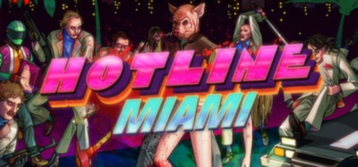
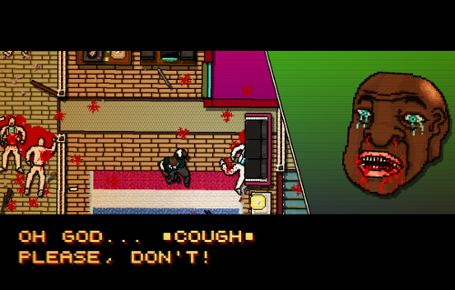
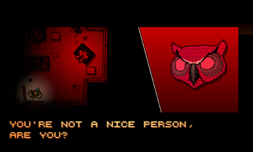

_This was originally published on my blogspot blog, but am reposting here because I can!_

This week I have finally finished Hotline Miami. Blog go!

I got Hotline Miami when it came out last year but didn't give it much of a chance. I liked playing the game but the visuals legitimately hurt my head after about 15 minutes of play. It has a retro aesthetic using low resolution graphics that are constantly rotating and zooming and pulsing and colours and shooting pain right into my eyes! It meant that I could only play the game in short bursts, which after a little while got annoying so I put the game down. In the past couple of weeks I've been playing through it again, I still get pain in the brain if I play too long but doing a level a day has let me enjoy it safely. I am getting old...

Hotline Miami is a top-down murder-em-up set in 1980s Miami. You play as a crazy person who gets messages left on their answering machine giving an address under the assumption that they'll go to the address and murder everybody there. You're given no information on who your character is, who the people you're murdering are, or why any of this is happening. The story is told through dream-like cutscenes featuring men wearing animal masks talking in meta nonsense. Oh, your character also wears an animal mask when murdering, so the other men wearing animal masks may or may not be fragments of a multiple personality. Or maybe you're part of a gang of mask wearing murderers. Or maybe the crazy man has weird dreams. Maybe the entire game is a dream? The story's told in a way that any interpretation can be correct and that fits how the game is presented. There's even a short post-game campaign where you play as a different character who murders the previous protagonist after barging into their campaign, creating an entirely different continuity. The mess of a storyline is brilliant.

After two blog posts I've finally realised I can embed youtube videos, so that's what I'm going to do. Here's an incredibly sexy live-action trailer that was made for the launch of Hotline Miami:

<iframe class="aligncenter" src="https://www.youtube.com/embed/UgXM7ivgYTo" width="560" height="315" frameborder="0" allowfullscreen="allowfullscreen"></iframe>

Hotline Miami is excessively violent. Every person you kill explodes with ludicrous amounts of blood. You have a whole host of weapons to choose from and killing with them all feels great. Unlike most other games that are produced, Hotline Miami knows exactly why you play it and doesn't try and treat it as otherwise. You don't play Call of Duty because you want to save the world from terrorists, you do it because you want to shoot people in the face. But that isn't how the game is marketed. There seems to be an unspoken rule between developer and consumer, the truth of why people play gets hidden behind some narrative construct, most likely to make them not think about all this murder. When playing Halo, Cortana will tell you to "Get across the bridge and turn off the distortion field! We've got to warn them about the gravity well!" but that isn't what she means. What she really means is "Go over there and murder all the dudes!" but she won't say it like that. It would be crass to say something like that. It's perfectly fine to go over there and murder all of the dudes, but only under the pretence of getting your communications back on line before the Infinity gets too close to Requiem. Hotline Miami doesn't give you that pretence. It says "Go over there and murder all the dudes!" so that's what you do. And it is bloody.

**\[SPOILERS\]**

There's an excellent cutscene later on in the game when the player confronts the people behind the mysterious answer machine messages and asks "Why are you making me do this?" as if when somebody leaves an address on your answer machine you are forced into going there and murdering everyone. When they reply "It's a game. Aren't you having fun?" it presents a wonderfully meta concept. You, the player, are the one forcing the character in the game to commit all these atrocities, and you probably are having fun. Brutally murdering people. Just because the game told you to. With no reason behind it. Hotline Miami is an incredibly violent game that is giving an anti-violent message. It's having it's cake and eating it too. It lulls you in with it's fun murdering and hits you with a message saying you shouldn't like this sort of thing. It makes you feel bad for having enjoyed it because you really should feel bad for finding pleasure in murder...

The game then gives you the option of murdering the people you're talking too. Which of course you take, murdering people is super fun!

**\[END SPOILERS\]**

I don't really have anything to say here, but I wanted to have another screenshot so needed a paragraph of text to break it up... Oh, I know what I can say.

The levels in Hotline Miami all follow a strict formula. You go to a building, murder all the people in the building, leave the building. It follows that formula almost exactly for most of the game, so when the formula gets mixed up it feels awesomely special. It happens a couple of times so it never feels gimmicky, the level where upon walking back to your car an armored van smashes through the front door was an unexpected surprise that really helps the game feel less like a collection of levels and more like a cohesive whole. There are a few other small things that help with this, the loading screens being scenery passing by in a car is a wonderful dichotomy. It hides game mechanics, in this case a loading screen, to make the entire experience more seamless. But between each level there is a huge title screen giving the name of the stage. It's a beautiful contradiction, at times the game is hiding the fact that it's a game, at others it revels in it.

Following on from what I said about Jet Set Radio, the music in Hotline Miami is brilliant. It's mostly a mix of chiptune with funky bass lines and rocking riffs. During the dreamy cutscenes the music is more sinister and creepy but in gameplay the music is high energy and super cool, it's primary purpose is to make you feel awesome about murdering all of the dudes. It makes you feel like you're taking part in a kickass action scene and is a huge part of the game's aesthetic. The music fits incredibly well with the graphics and I love it.

After you've killed everybody in a level, the music stops and your character has to walk back to their car, traversing the carnage they left behind. It's an excellent use of silence as when you were murdering everyone just a few short seconds earlier you had the music rocking away in the background, pumping you up and making you feel doubly awesome for all the violence you're committing. But in the silence you have to walk over the bodies you've slaughtered and are given some time, if only a few seconds, to reflect on what you've done. It's marvellous. A sequel had recently been announced, so I'm going to embed the teaser trailer for that here:

<iframe class="aligncenter" src="https://www.youtube.com/embed/YcIgabcx-9Q" width="560" height="315" frameborder="0" allowfullscreen="allowfullscreen"></iframe>

The melancholic music present in this trailer is sublime. From the small snippets released about the sequel so far it looks like they're going for a much more down tempo game, not simply copying the high energy of the first and instead going in the opposite direction, keeping the gameplay much the same but completely changing the tone of the game. It will be interesting to see how this makes the game feel, the first being a psychedelic sugar rush of violence and empowerment, the sequel perhaps being the crash that follows. That would be nice, make me feel bad about all this murder.

Hotline Miami is cool, it's brutally violent without glamorizing it but most importantly it's fun. It's everything an indie game should be in this day and age, it does something you'd never see in more mainstream games and does it in a way that plays to it's strengths whilst hiding it's weaknesses. It's a low budget game that is overflowing with ideas and you should totally play it!

I played through Hotline Miami on the PC through Steam. I currently have 10/35 achievements. Getting A ranks is hard!
