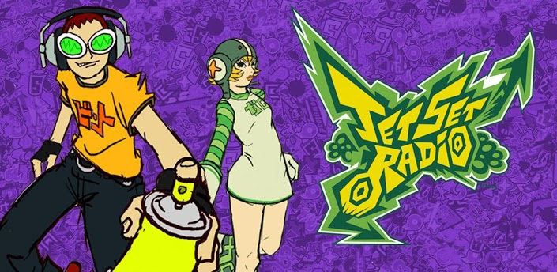
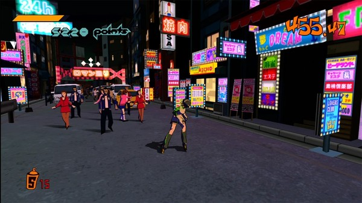
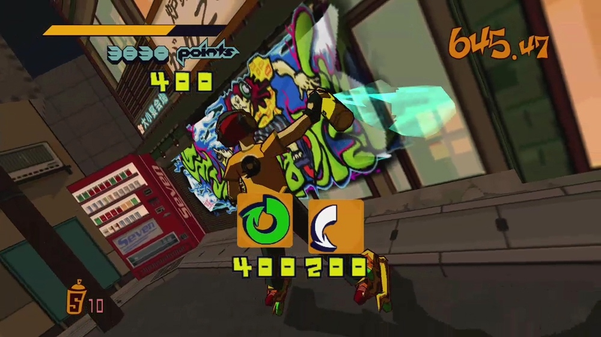

_This was originally published on my blogspot blog, but am reposting here because I can!_

Over the past week I've been playing Jet Set Radio HD and I thought that's as good a thing as any to blog about, so let's shake it!

Looking back on it, the Dreamcast was the last great games console. Going forward from it game production costs have skyrocketed, causing innovation to decline and originality to become an afterthought instead of the main driving force in game development. All of the new IPs the Dreamcast launched were products of a much earlier time in game design, back when things didn't have to make sense or be seen as marketable to the widest audience possible. There were titles where you played as [sky pirates](http://en.wikipedia.org/wiki/Skies_Of_Arcadia), [dancing aliens](http://en.wikipedia.org/wiki/Space_Channel_5), [insane taxi drivers](http://en.wikipedia.org/wiki/Crazy_Taxi), [men collecting capsule toys](http://en.wikipedia.org/wiki/Shenmue), and of course rollerblading graffiti artists. It's a shame that all of those series' failed to gain traction in a post-Dreamcast world, with the XBox unleashing the [space marine juggernaut](http://en.wikipedia.org/wiki/Halo:_Combat_Evolved) and the PS2 securing huge exclusives for both the east and the west with [car stealing](http://en.wikipedia.org/wiki/Grand_theft_auto_3) and [endless adventures](http://en.wikipedia.org/wiki/Final_Fantasy_X). It's understandable that the Dreamcast-era games have seen minimal follow-up, it was under their watch that Sega fell in to financial ruin and had to drop out of the hardware market completely, so I can't hold too large of a grudge. However playing Jet Set Radio recently, it's made me think back on those times and what has happened to the games industry, and how quickly AAA shifted from originality to marketability...

Enough moping! I like being positive, and Jet Set Radio is a fantastic game. If you haven't heard of or played it, it's a game set in a hyper-stylised version of Tokyo where a bunch of rollerblading gangs fight for the streets using graffiti. You play a member of the GG's, a new gang that's all about having a good time and dancing, who recruit a whole host of members throughout the game. The goal of each level is to spray paint your targets whilst avoiding the police, the military and an increasingly bizarre number of villains. Behind all this is a weird storyline that's told via DJ Professor K, the DJ of the eponymous Jet Set Radio, about an evil corporation who are brainwashing rival gangs in search of a mysterious record. The story doesn't matter, but it's suitably off-the-wall none-the-less. Word-hypen-word.

The HD port of JSR came out last year and I snatched it up quickly but didn't really play it. I went through the first level then got distracted by something else so it sat on my 360, awaiting the day when I would play it again. That day came last week and I burned through it, painting loads of graffiti and grinding a whole bunch of rails. I had a lovely time. Was that time lovely due to nostalgia? I don't know. I played the crap out of JSR on the Dreamcast so it's certainly possible. My first hour or so of HD was spent annoyed at the controls which made me think the game wasn't as good as I remembered. But then everything clicked and I was doing amazing things, grinding from rail to rail, spraying some tags, grinding more rails, spraying more tags...

There isn't much gameplay-wise to JSR, and it would be debatable to say what it does have it does well, with the steep learning curve scaring off newcomers, but the game is oozing with style. The cel-shaded graphics of the game at a higher resolution look stunning, there is little graphically to date this game as old as it is (13 years!) and the visuals are beautiful. For the most part the cel-shading hides the low-poly models and low-res textures leaving you to marvel at the wonderful design work. With four distinct areas the game has heaps of variety, no muddy browns or boring greys here! Except in Kogane, which is mostly muddy brown. Or Benten, which is full of grey buildings. But Shibuya? That is a cavalcade of colours! All the levels are well designed with each looking and playing quite differently.

From a visual standpoint there's no black sheep, but from a gameplay standpoint there is, and that's Grind Square, a hyper version of New York's Times Square. All of the action takes place on top of a bunch of skyscrapers, which sounds awesome, but you will inevitable fall off. Instead of respawning you back up top, the game makes you skate about at street level, where there is nothing to do, and take an elevator back up. This wouldn't be so bad, but the finicky controls mean you'll fall a whole bunch of times and the 30 seconds you spend faffing about with elevators becomes quickly annoying. Consider yourselves picked, nits!

The music plays a huge role in JSR's charm. It features an eclectic mix of all different genres ranging from [funk](http://www.youtube.com/watch?v=g4JEpbHEuuM) to [electro-noise](http://www.youtube.com/watch?v=Cs0zrEzWBRI). With the storyline being told almost entirely by a radio DJ, the music being supremely cool was important. Few games seem to bother with their soundtracks, the only recent game I can think of with an awesome soundtrack is Wet, a game that went the style-over-substance route and failed miserably, but did so with such audible charm. There is little more to be said about the soundtrack, it's incredibly cool and I wish more games would take the time to do the same.

I did some googling around and came across a site that aims to continue the spirit of Jet Set Radio's soundtrack, promoting music that fits in with the eclectic mix that made the soundtrack so brilliant. The site is [jetsetrad.io](http://jetsetrad.io/) and it's pretty recent, seemingly only starting back in March, but there are already a whole bunch of tunes up and from what I've heard they generally fit with the aural aesthetic that JSR created.

Playing JSR has really got me in the mood to play some more so I'll be going through the sequel in the near future, it will be interesting to see how that holds up with my memories. And even though it's unlikely, I really, really hope Sega decide to bring this franchise back. I can't seem to find any sales figures of the HD mix but [this article from Major Nelson](http://majornelson.com/2012/09/26/live-activity-for-week-of-september-17/) shows JSR as the 2nd highest-selling XBLA game behind Minecraft for a week, so it at least did well for a few days...

Purely for informational purposes, I got 400/400 achievements in JSR HD, over a total of not-quite 4 playthroughs. Woo!
