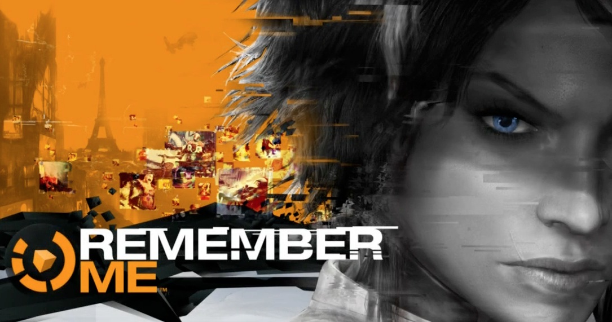
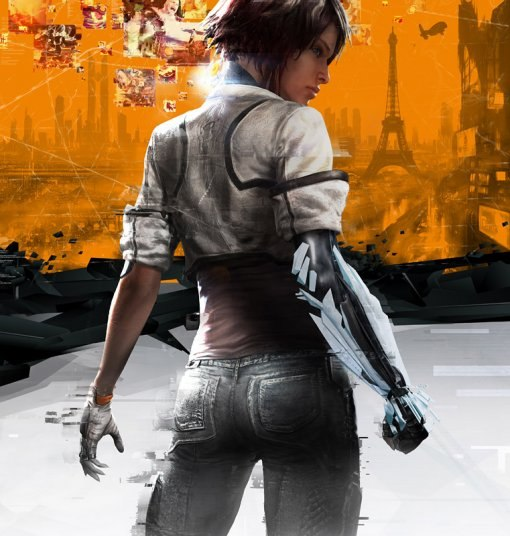

_This was originally published on my blogspot blog, but am reposting here because I can!_

I played Remember Me. I'm going to blog about it. Because that's what I do!

Remember Me is an action-platform-puzzle game set in a cyberpunk-styled future Paris, about a girl named Nilin who wakes up after having her memory wiped and gets thrust into her former life as a freedom fighter/terrorist, fighting against the evil corporations that market and abuse memory alteration hardware. The combat is a shoddy knock-off of the freeflow system that [Arkham Asylum](http://en.wikipedia.org/wiki/Batman:_Arkham_Asylum) popularised, the platforming is a shoddy knock-off of the jumping and climbing that [Uncharted](http://en.wikipedia.org/wiki/Uncharted:_Drake%27s_Fortune) popularised, and the puzzles are... a quite interesting new mechanic involving memory manipulation that's halfway between [Inception](http://en.wikipedia.org/wiki/Inception) and [Psychonauts](http://en.wikipedia.org/wiki/Psychonauts).

The gameplay of Remember Me is unfortunately sub-par, the combat is based around performing combos, but doing so when against multiple enemies is annoying rather then challenging, and the platforming is generic instead of exciting. Not all is doom and gloom however, the art design is wonderful. Paris of the future is full of wonderful technology that feels like it could possible happen. There is augmented reality everywhere, very little that's relevant to gameplay but it's very immersive. There are menus projected in front of restaurants, names projected above people's heads, warnings projected in front of dangers, all of which are believable and very cool.

The developer of Remember Me, Dontnod, had [trouble finding a publisher](http://www.penny-arcade.com/report/article/remember-mes-surprising-connection-to-facebook-and-why-its-protagonist-had) because the protagonist of the game was a woman, which in a publisher's mind means the game wouldn't sell. Even with publisher troubles Dontnod kept their integrity by not changing Nilin into a dude, but apparently didn't have enough integrity to avoid the cover art of the game being a shot of Nilin's ass.

The writing is all over the place. At moments there is excellent introspection, at others there is moronic psuedo-intellectualism. When you first use you memory altering abilities to alter somebody's personality, Nilin has a monologue about how this power is quite dark and questions herself for using it, hopefully making any player who thought it was a cool ability to take a second look. A late-game reveal is treated especially well with it occurring as on off-hand remark during gameplay. When it's then mentioned in a cutscene it's done so with no fanfare, fully trusting that the player would pick up on it themselves. On the other hand, there's a supporting character named Bad Request, a great name for the wacky hacker he's introduced as, but as soon as he's involved in some drama it becomes hilariously out of place. "Dammit, they're doing horrible things to Bad Request! I have to save Bad! Baaaaaaaaaaaaaaaaaaaaaaddd!!!"

When considering the bigger picture the writing is great, when down to dialog it can be silly. The memory altering storyline knows that you think there will be some crazy twist, but the story twists all occur in unexpectedly smart ways, nothing seems gimmicky in that regard.

Possibly the worst thing about the game was the ending. I won't spoil it, but the end boss was incredibly fucking stupid. It wasn't necessary and ruined the mood the game had spent creating for the 15 minutes prior. For a game that was trying new things it seems poor judgement to leave that boss in, I can't imagine anybody who was liking that game up to that point would have been disappointed by it's removal.

Getting nit picky, I think that cutscenes not being skippable is basically unacceptable. I'm sure there are some insecure writers out there who think their vision must be appreciated, but when you design your game around multiple playthroughs, having to watch the cinematics again when all you want to do is mop up achievements is maddening. It should be mandatory that cutscenese are skippable, nobody who cares about the story is going to skip them on their initial playthrough, and if people don't care about the story you've either done a poor job at telling it or they weren't going to care in the first place. Shape up people! This is basic game design here! A related quibble, checkpoints _before_ cutscenes? Shame on you game, shame on you...

This all sounds like me being negative, but I really liked Remember Me. It has a whole bunch of flaws, most of which could be easily fixed given a bit more time, and it saddens me that the time wasn't taken. Production values feel high, but with the public publisher problems Dontnod had I doubt the game had _that_ high of a budget. It never feels cheap, which is important, but a bit more polish in the gameplay department would have helped immensely. The game is at least interesting and has new ideas, they surely knew going in it would be a battle to get this game released and it would be a shame to criticise it for being too ambitious.

It would be acceptable to say that Remember Me is not a good game. It's trying _really_ hard to be one, but it fails in most regards. It succeeds in a few ways, and if you're willing to trawl through some bad to get to some good, then it can be a pretty great game. At the risk of sounding horribly cheesy, I choose only to remember the great bits of Remember Me, and in doing so the game is excellent.

I played Remember Me on the Xbox 360 and got 1000/1000. After an initial playthrough on hard I went through on easy to get all the achievements.
