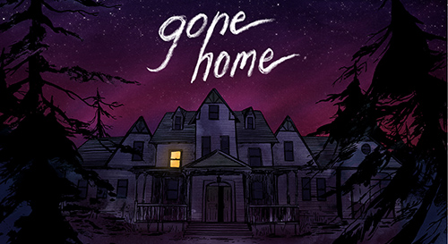

_This was originally published on my blogspot blog, but am reposting here because I can!_

I started writing up a big long piece about a thing but it was taking forever. Then I played [Gone Home](http://www.gonehomegame.com/) which turned out to be pretty great and also much easier to write about. So I'm going to do that. Right now!

 Gone Home is described as a "story exploration video game" on its website. What that means is it's a game about wandering around an empty house. You play as a 20ish year old who's just returned from a year gallivanting around Europe to the new house her family moved into while she was away. Upon arriving at 1AM you find the house ransacked and the family members missing. You're then given control and can explore the house, look for clues and try to figure out what's happened in the year since you've been gone and where everyone is.

Exploring the house is basically all that you do, and it's riveting. The game is set in the mid-90s, which means there's VHS tapes of the X-Files and bootleg cassettes of riot grrl bands for you to find. It also means nobody has a mobile phone or the internet which handily removes any plot contrivances those things would've created. You search through the house finding little bits of information that fit together to create a history of the house and the family that lived there, uncovering the trials and tribulations they went under while you were away. What's great about this is you're rarely given the whole story about what's transpired, just a few tidbits, leaving your own imagination to fill in the gaps. Sometimes things are obvious, sometimes less so, but's it's a wonderful way of telling a story. For example, you find a letter addressed to the father telling him that his reviews of stereo equipment are no longer cutting it and if he keeps this up he'll lose his job. A few rooms later you find boxes and boxes of the same book, written by him, clearly showing that he's a failed author who's reviewing these things as a fall back. You then find a hidden bottle of booze in his study and things become even darker. This type of storytelling is prevalent throughout the game and it's great.

Upon picking up certain objects you will trigger an audio log from Sam, the main character's younger sister, detailing what's gone on with her life in the form of a diary entry. The voice acting for these is pretty incredible, they cover a huge range of emotions but it's never over-acted, it's all done very naturally. I've never heard the actress before and it would not surprise me to see her show up in whole lot more games in the near future.

Here's a trailer for Gone Home that features some of the voice acting and a bit of riot grrl. What I love most about this trailer is how it gives off completely the wrong vibe you'd want to send out for the game, but does so with such style. The ending where they put the tape back in the drawer is such a hilarious little moment, I love it.

<iframe class="aligncenter" src="https://www.youtube.com/embed/sqSbYsUalMQ" width="560" height="315" frameborder="0" allowfullscreen="allowfullscreen"></iframe>

A big part of what I like about Gone Home is very spoilery, so I'm going to hide the next bit. Don't read this if you plan on playing the game! I'm super serial here guys.

**\[SPOILERS\]**

Gone Home being a game gives an expectation to the player that at some point, something _will_ happen. That there will be a moment in the game where you have to actually do something in a game-like manner. Shoot a dude, solve a puzzle, any type of action. For the first third or so, or at least in the way I explored the house, the game was setting up the mystery of the house as supernatural in nature, that the family had been haunted by a poltergeist or something like that. The distressed messages on the answer machine, the pillow fort in the living room, the electrician unable to detect why the lights go on and off. The game never says "Hey, a ghost murdered everyone" it instead gives you a bunch of facts, and you as a player playing a game take those facts and construct a narrative that makes sense. _Gone Home is a spooky game where you explore a spooky house, of course there's going to be ghosts_ I thought. But as soon as Sam's relationship with Lonnie became obvious all references to supernatural happenings seemingly disappeared. The game suddenly became a completely different entity and it was awesome. I thought the game was one thing based on random information I had, but a single new piece of information changed my understanding of the game entirely. And this wasn't just a plot twist, before the relationship took centre stage I assumed at some point I would fight a ghost or banish Uncle Oscar's soul to hell. Afterwards it became a family drama. The very genre of game and how I was supposed to play it changed based on a single kiss. Yeah!

While I have the spoilers up, I'm going to talk about the ending. Up until the very last audio log I had no idea how the game was going to end. This was all supremely tense as I genuinely cared about Sam and didn't want this game to end unhappily. I opened the attic door and wondered if I would find Sam and Lonnie spooning in bed and it would all be lovely. I climbed the attic stairs and saw the empty bed. Dammit. There was a note on the bed and a dark corridor off to one side. Given that the game had just faked out a happy ending I assumed it was going to have a disastrous one. In my mind I would find Sam having hung herself at the end of the corridor. This was terrible. I picked up the last note and Sam sounded depressed. I refused to walk down the corridor. If she was dead this game would have crushed me. But she wasn't. Her voice reading the journal turned extremely happy and excited! Lonnie had gotten off the bus! Yes! This was excellent! I ran round the corner and found the journal and all was right with the world! The most amazing part of my final minutes of gameplay was how my experience came about solely based on how I had interpreted the items I had found. The game didn't lead me down one path to make me believe one thing and then throw a twist at me. I went down that path of my own volition, using my own mind to create a narrative based on how I would interpret the evidence. Does it speak poorly of me that when confronted with a depressed teenager my thoughts instantly turned to suicide? Did I subconsciously want the game to end up as a tragedy because I'm a masochist who wants to feel unhappy, because the narrative left me with no other interpretation, or was it because the creators actually designed the game to be that way? I don't know. And that's awesome.

**\[END SPOILERS\]**

I should have just spoiler tagged this whole post...

Gone Home is lovely. It turns wandering around an empty house into an experience filled with conflicting emotions bought about by self-constructed narrative. It's atmospheric, detailed, has great voice acting and sound design in general, it looks gorgeous. It's awesome. You should play it. It's made by [The Fullbright Company](http://thefullbrightcompany.com/gonehome/) and you can get it from their [site](http://www.gonehomegame.com/). And now I'm pleased to leave you with the Princess of Power.

