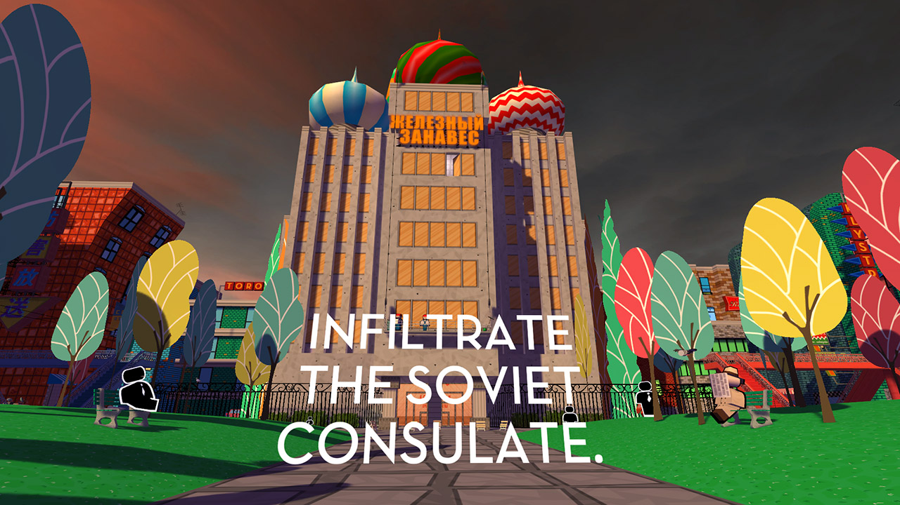

Jazzpunk! It fell into my Steam Library via a Humble Bundle, it’s the third game in the Veizy.com Steam Summer Sale Playtime, but it’s the first where I’ve broken one of the rules. Instead of playing the game for an hour, I instead played it until completion which took about two and a half hours. A short game for sure, but an excellent one!

Jazzpunk is a first-person comedy-art puzzle game. You play as a secret agent operating out of a train station and must undertake missions heavily influenced by the aesthetic of 1960s spy fiction. There are also a large number of references to sci-fi, video games and other alt-pop culture sprinkled throughout. There’s a side quest where you must help a frog cross the road. You throw a jar of spiders in someone’s face. You return rented videos. It’s brilliant. Its short running time is filled with so many ideas that I found genuinely hilarious and I’ve never really encountered before. Perhaps the funniest moment for me is early on when you infiltrate the soviet consulate and get an unexpected camera move. It’s a genius idea that can only be done in video games and I loved that the game was funny in multiple different ways. Even top-tier comedy games like Portal still rely on just excellent writing to be funny, whereas Jazzpunk makes jokes with its gameplay mechanics and that’s amazing. There’s a brilliant [YouTube video by Every Frame A Painting about Edgar Wright](https://www.youtube.com/watch?v=3FOzD4Sfgag) that explains this better than I can, and although that video is about cinema, the idea that there are multiple styles of comedy and most aren’t being used is true in video games too.

Jazzpunk most reminded me of the excellent work of [Blendo Games](http://blendogames.com/), specifically Gravity Bone and Thirty Flights of Loving. I would highly recommend both of those, Gravity Bone being available for free from the Blendo website. They are first-person spy-comedy games that have a similar aesthetic and I love them both.

I ended my previous two mini reviews with the question of whether or not I would play the game more. Seeing as how I finished Jazzpunk the answer would be no. The game has a lot of side stuff in each level, but I feel that I found the vast majority so there isn’t much replay value for me. I would still highly recommend everyone play it. It’s the best game I’ve played in the Veizy.com Steam Summer Sale Playtime so far, and if you’re the type who gets annoyed if a game is too short then make sure you buy it when it inevitably comes on sale. Do it!

[Jazzpunk Website](http://www.jazzpunk.net/) [Jazzpunk Steam Page](http://store.steampowered.com/app/250260/Jazzpunk_Directors_Cut/)
