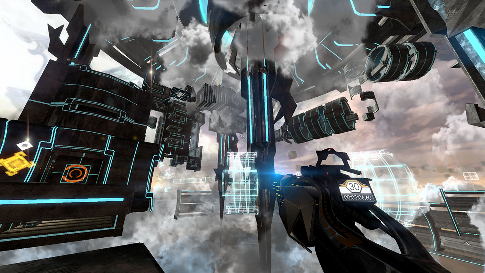

What I love about the Steam Summer Sale is that so many games go on sale for such a cheap price, it’s almost impossible to not look at what the games are. When a game I’ve never heard of is available for £2 it would be insanity not to see what it’s about. And with DeadCore I am so glad I did.

DeadCore is a fast-paced first-person platform game. The official synopsis says it’s for speedrunning and it’s clear the game has been designed for people who can do super impressive trick jumps at high speed. You have double jumps and air dashes at your disposal and your goal is to keep going forward! This is a purely gameplay-focused game, but there are some text logs to pick up that give some context to the abstract world you find yourself in.

The game looks gorgeous. The platforms are all floating in a fog-filled void with some sort of whirlpool-esque thing far below. I love the art design, it hits me right in the cyberpunk. The music is great too, it has the right level of rhythm and oomph to enhance your jumping and make everything feel so cool.

On the whole, the gameplay feels lovely. The player movement is smooth and the level design is such that you never have to slow down, you keep to the rhythm and you keep moving. I ended up finishing the 3rd level during my playtime, and I was slightly annoyed by some of the laser grids you had to dash through. I felt the game was a bit unforgiving with how accurately you must dash through small laser tunnels, there was one checkpoint where I easily died 20 times messing up by dashing into the lasers, and the game doesn’t really give you feedback on whether you were too high or too low. It’s a bit nitpicky because by the end of the level I was getting a feel for the laser tunnel dashes, but I still feel it’s a valid point.

To be played again? Yes! There’s a specific part of my brain that loves running crazy fast, jumping in-between rotating death lasers, and being flung through the air by pressure cannons. DeadCore appeals specifically to that part of my brain and it is glorious. Play it!

[DeadCore Steam Page](http://store.steampowered.com/app/284460/DeadCore/)
