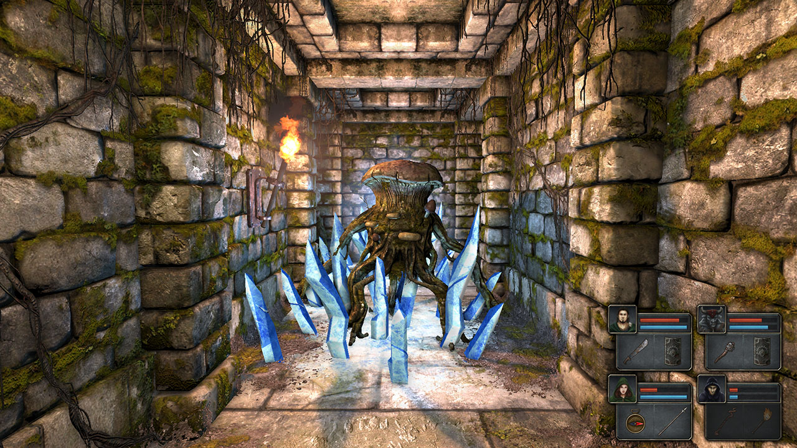

The first game I bought in the Steam Summer Sale 2015, it’s Legend of Grimrock!

Legend of Grimrock is a first-person grid-based dungeon-crawler action-rpg. You command a team of prisoners who are absolved of their crimes by being thrown into Mount Grimrock, a scary mountain full of monsters and traps that nobody has ever escaped from. I wandered around the dungeons murdering things, standing on pressure plates, and opening doors with keys. It has a lovely old-school Dungeon Master feel but without being bogged down by the tedium that older games tend to have.

The game looked very nice, but in the hour I played there wasn’t much variety, the walls and floors were all the same grimy stone. It’s entirely possible – and probable I suppose – that if you descend further the scenery will change, but I can’t comment on what I didn’t see. The lighting effects were very lovely and the monster design was interesting. In my short playtime I fought giant snails, skeleton warriors, two different sorts of weird mushroom monsters, and some horribly flying bat thing.

I found the combat to be a bit slow paced for my liking. Most fights involved me hitting the monster for low damage, then the monster hitting me for low damage, and this repeated for about 30 seconds. It wasn’t difficult to fight enemies, just time consuming. I think if enemies did more damage to me per hit, and I did more damage to enemies per hit, the game would go quicker but wouldn’t change the end result. Also, I didn’t appreciate the game flat out lying to me. “Only the 2 characters in the front can do melee attacks” the game said, and I believed it because why would the game lie to me? And then after 15 minutes of an unused spear in my inventory, I accidentally equipped it to a character in the back and discovered it was a long weapon so could be used to attack. Thanks game!

This mini review came off more negative then I was expecting, but I really liked Legend of Grimrock and I will be playing it again. I had a lovely time killing the giant snails and I felt the game did a great job of capturing the feel of old-school dungeon-crawlers but updating them for modern times. Wonderful!

In the interests of full transparency, I bought the Grimrock bundle that contained the sequel as well, but I’m not going to play it as part of the VSSSP because playing a sequel before finishing the first would be wrong on multiple levels. This technically breaks one of my rules, but they’re my rules so I can break them however I want! Haha!

[Legend of Grimrock Website](http://www.grimrock.net/)
[Legend of Grimrock Steam Page](http://store.steampowered.com/app/207170/Legend_of_Grimrock/)
