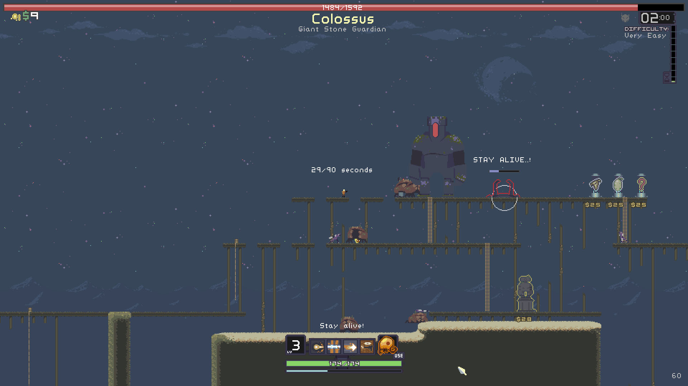

I got Risk of Rain in a Humble Bundle I think, and it’s pretty rad. How rad? You’ll find out right after this gigantic image!

I went into Risk of Rain knowing little about it. It turns out the game is a rougelike action-platformer. Your character is a space marine-type who is aboard a cargo ship full of monsters and special items that is attacked by a dude with a huge sword, causing all the stuff to fall onto the planet below. You then battle through the monsters using a random assortment of the special items in order to activate teleporters that will inevitably lead you to victory.

I played 3 games of Risk of Rain, I didn’t quite hit the hour mark but it’s a roguelike, I know what the deal is. There are multiple different characters to unlock, but you only start with the one so he’s the only one I played as. I found the movement to be quite nice but was slightly dismayed by the shooting. Not being able to shoot up when there are flying enemies who have full 360° movement is annoying; having to run away just to get a good vantage point isn’t something that takes skill, it just takes time and that makes me feel urgh. Aside from that small problem I liked the combat. The different types of gun attack felt nice, the standard attack felt standard, the heavy attack felt nice and meaty, and the combat roll felt cool.

The graphics are gorgeous. They are a minimalist pixel style that look lovely. The design of the monsters is great, they’re the type of thing that would probably look generic if rendered at a proper resolution, but the limited pixels really help to differentiate them from every other game out there. The pixel art explosions are also lovely, I am a huge fan of a good animated explosion. The soundtrack sticks with the retro theme, sounding very chiptune-y but with some actual instrumentation too, and compliments the visuals wonderfully. My ears and eyes were happy.

Am I going to play Risk of Rain again? Yes, I am. I like roguelikes but I feel the genre has become slightly overcrowded recently – I assume due to the success of Spelunky and Binding of Isaac – which has sort of put me off playing some of them as it feels like some developers are trying to cash in on what’s hot right now. Risk of Rain does not make me feel that. It’s been made with the love and care that only someone who truly loves shooting monsters in the face can feel. It’s good.

[Risk of Rain Website](https://riskofraingame.com/) [Risk of Rain Steam Page](http://store.steampowered.com/app/248820/Risk_of_Rain/)
