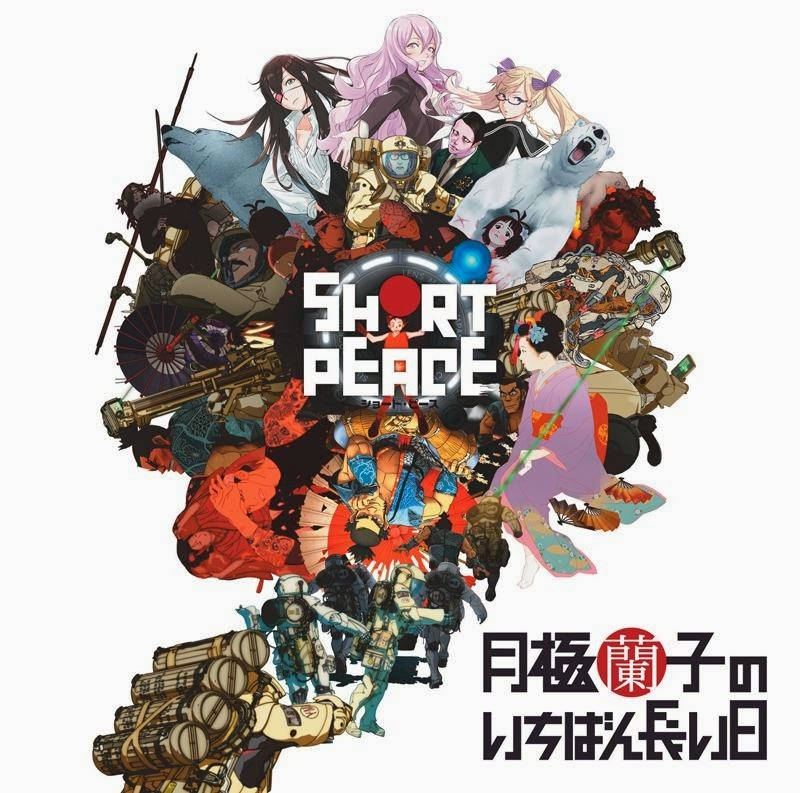
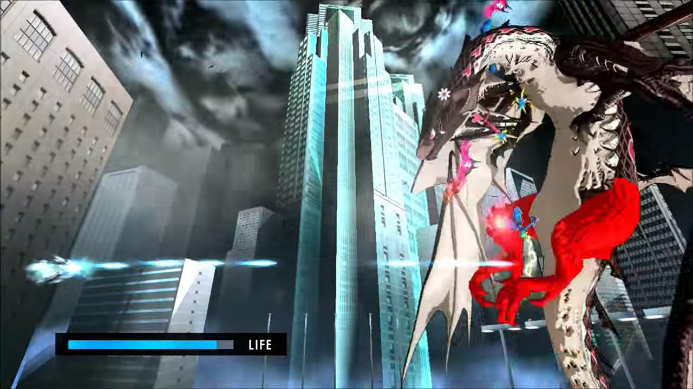
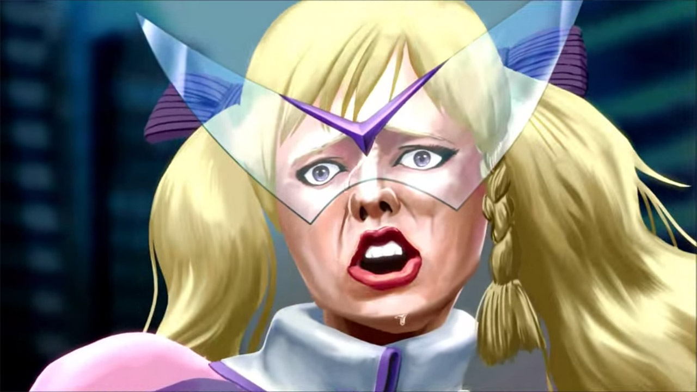

Short Peace – Ranko Tsukigime’s Longest Day is a succinct and easy-to-remember title for a game. It only came out a year ago, totally within the time limit for an exciting review. Also, it’s a PS3 exclusive. Long live the old generation!

Short Peace is an anthology of four short anime films and one short anime game. One of the short films was directed by [Katsuhiro Otomo](https://en.wikipedia.org/wiki/Katsuhiro_Otomo) who wrote and directed [Akira](https://en.wikipedia.org/wiki/Akira_(manga)). The game was written by [Suda51](https://en.wikipedia.org/wiki/Goichi_Suda) who heads up [Grasshopper Manufacture](https://en.wikipedia.org/wiki/Grasshopper_Manufacture) and is primarily responsible for games like [No More Heroes](https://en.wikipedia.org/wiki/No_More_Heroes_(video_game)) and [Lollipop Chainsaw](https://en.wikipedia.org/wiki/Lollipop_Chainsaw). I can tell you right now, this is so going to be my jam.

Starting with the four short films, they are all set in Japan during various time periods. Three are set in the past, one set in the future, and the game is set in the present.

Possessions is about a man getting lost in a forest during a storm and taking shelter in a small shed. Unfortunately for him it’s filled with discarded items that have become possessed by spirits and are seemingly angry at the humans that have tossed them aside. The film deftly switches between horror and comedy, as the strange spirits want to torment the man but he just sees them as useful spare parts. It’s very good.

Combustible is the most artsy of the four and is about a girl from a rich family who is being forced into a marriage she doesn’t want, while longing for the time she spent as a child playing with her rebellious neighbour. Large portions of Combustible are shot as if inside a scroll painting and looks really lovely. The story is the most tragic of the four, and is very good.

Gambo is about a giant bear fighting a demon from space. YES! What more do you need? It’s pretty excellent.

A Farewell to Weapons is set in a post-apocalyptic future where a small military team fight an AI-controlled tank. This was my favourite of the bunch as it had mechs and explosions and all that good stuff. The action scenes are incredibly tense, you are quickly introduced to all the characters and they’re reasonably likable so you don’t want them to die horribly. It is the most excellent.

All of the shorts are great, I would recommend trying to see them. I linked to them on Youtube but only two have English subs on them.

On to the actual game part, and we have Ranko Tsukigime’s Longest Day! It’s a 2D platform game in which you mostly run right as fast as possible, hitting enemies and jumping onto platforms. If you go too slow, evil spirit hands will catch up and murder you so there is a racing aspect to the game. A few levels eschew this formula, but there isn’t a lot of variation. The game is short too, about an hour long, and a large chunk of that is made up of cut-scenes. Glorious cut-scenes.

The actual gameplay of Ranko’s Longest Day isn’t anything interesting, but the story written by Suda51 is absolutely amazing. The game intentionally fills the short running time with the most overblown, dramatic, and cliched story possible. Ranko Tsukigime is a seemingly normal teenage girl but she’s actually an assassin who uses a violin-sniper rifle, on a quest to murder her father. Along the way she kills people, encounters spirits, discovers her best friends have magical powers, and fights masked lucha libre wrestlers. The entire game is filled with ridiculous plot twists that poke fun at various tropes inherent in anime and could easily fill up a standard 26-episode anime season. And it all takes place in about twenty minutes of cut-scenes.

Every cut-scene in Ranko’s Longest Day is animated in a different style ranging from standard anime animation, 3D CG, static manga panels whizzing about the screen, and my personal favourite, a sort of painted homage to 80s shows like Fist of the North Star with the characters having weirdly detailed/ugly faces. It’s great. The ending is also brilliant, as the game shifts from anime to live action with [an idol group singing karaoke](https://www.youtube.com/watch?v=JUcjUtjihK8). I love it so much.

Were I judging Short Peace as solely a game it would be difficult to recommend. The gameplay is basic and it’s very short. The story is wonderfully chaotic, but twenty minutes of great cut-scenes aren’t enough to make up for the shortcomings. As it also comes packaged with the four short films I would highly recommend it if weird short films are your thing. They’re are all highly entertaining and interesting, and you should probably watch them. And play the game as well.

I completed Ranko Tsukigime’s Longest Day in a little over an hour and earned 5 of the 14 trophies available, the other nine are for collectibles and stuff that I can’t be bothered with. It’s unlikely I will ever play it again. It took about an hour to watch the four short films, bringing the total time for Short Peace to two and a bit hours.

[Short Peace at Amazon UK](http://amzn.to/2Ec0qNn)
[Short Peace Wikipedia](https://en.wikipedia.org/wiki/Short_Peace)

In generating my links I discovered this was never released at retail in the US and is only available on the US PS Store for $40! That’s quite high. I’m hesitant to recommend Short Peace at all for that price. You can pick up just the four anime segments for $14 from Amazon US, which is still much higher than the £5 for everything on the UK release. Nice to see the US getting the shaft for once. Sad to see a cool, weird thing being priced so stupidly.
