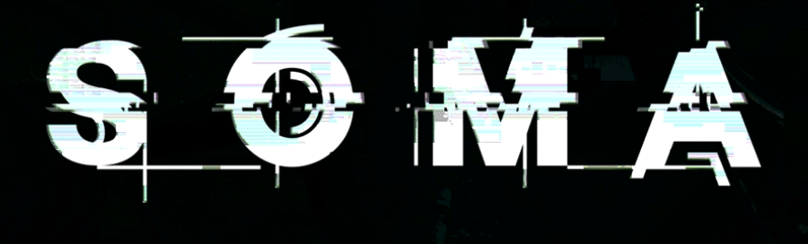
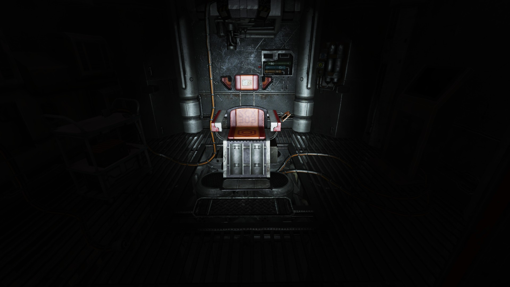

Hello Veizy.com exciting website. It has been ages since I wrote anything because for the past couple of months all I’ve played is Rare Replay, which is super awesome and highly recommended but not that interesting to write about. I have now just played Soma, the new game from Frictional Games, and that IS something interesting to write about. So I’m going to write about it now. Now. NOW!

Soma is a sci-fi horror game by Frictional Games, who are probably most famous for the fantasy horror game [Amnesia: The Dark Descent](http://store.steampowered.com/app/57300/Amnesia_The_Dark_Descent/). Soma is an evolution of the gameplay from Amnesia, putting more emphasis on narrative structure and doing away with much of the monster sections and physics puzzles. A change for the better is what I think.

In Soma you play as a man who, in recovering from a car accident, agrees to an experimental brain treatment from a slightly shady doctor. After sitting in an incredibly creepy brain-scanning chair, you wake up 100 years in the future on a research station at the bottom of the sea that’s falling to pieces. There are also creepy robots out to murder you for unknown reasons who you have to avoid. Like Amnesia before it, Soma is combat-free. Enemies must be avoided rather than confronted.

The story of Soma is brilliant. It discusses many mature themes about philosophy, identity, and the nature of being, and somehow it does all that with real sincerity and without being pretentious. A huge improvement over Amnesia is how the game deals with real issues and you have real problems to solve. For example, in Amnesia you’re dealing with magical mystical orbs and unknowable Lovecraftian horrors. In Soma you have to restore power to essential systems, or transfer data from one computer to another. The tasks are more mundane but also grounded in reality and to me, it felt like I had greater connection to the character. It also helps that you play as someone from modern times who awakens in the future, as opposed to the 19th century man from Amnesia.

One of the major things I liked about Soma is how it doesn’t let its mystery drag on. There are a few possibilities for how you woke up at the bottom of the sea, and it isn’t that long until the game tells you what’s up. I had expected for the reveal to be a late game twist and set myself up to be annoyed as the game would throw curve balls at me, as it tricked me into believing the wrong thing. As it was, a subtle thing happened that I picked up on, and then about thirty minutes later the game explained everything. This does leave the unintentional problem of being unable to talk much about the story or characters, as doing so would spoil the first part of the game where you have no clue what’s going on.

My only real problem with Soma is the enemy encounters. You can’t fight the evil robots so you have to either run away or hide from them. This is supposed to make your character feel helpless and weak, but it just feels annoying. There are a few sections that work well with enemies, but they were limited to places where you only have to perform simple tasks whilst avoiding them, such as turning a valve when the robot’s back is turned. Later on in the game where you have to navigate tight tunnels and do complex tasks, the enemies are just an annoyance. There’s no real penalty for death, getting caught by a robot makes your screen go a bit fuzzy and if you get caught too many times you have to restart the section, so enemy sections lack tension. I imagine after the backlash Amnesia-sequel [A Machine For Pigs](http://store.steampowered.com/app/239200/Amnesia_A_Machine_for_Pigs/) had for its simplistic enemy encounters, Frictional felt they had to make enemy presence more notable, but I think the game would have been better off with a different take on how the enemies should be presented. As is, they don’t really fit in with the high-concept themes the game is trying to convey, following up a monologue about the nature of self with a game of hide and seek with a creepy robot doesn’t really fit. However, this problem is in no way a deal breaker. There were only two enemy sections in the game that I felt were truly frustrating, the rest were solely an annoyance.

I would completely recommend Soma to anyone who can handle mature themes mixed in with a few scares. It isn’t that long and explores subject matter not usually found in video games, told in a very video game-y way. Recommended!

I played Soma on Steam where I finished the game and got all 10 Steam Achievements in a little over 7 hours. The achievements were all story-based and unmissable. Soma is also available for Mac, Linux, and PS4.

[Soma Website](http://somagame.com/)
[Soma Steam Page](http://store.steampowered.com/app/282140/SOMA/)
[Soma UK PSN Page](https://store.playstation.com/en-gb/product/EP1188-CUSA03200_00-HPL3SOMAGAME2015)
