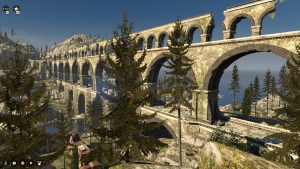

In an effort to stay up to date with the hottest releases in gaming, here’s a review of some DLC that came out in July for a game that came out last December, it’s the Talos Principle and Road To Gehenna, developed by Croteam and published by Devolver.

The Talos Principle is a post-Portal first-person puzzle game, where you play a robot who awakens in the middle of some mysterious ruins and is compelled to complete a number of puzzles by a mysterious voice from the sky. Puzzles are small and self-contained chambers, which are grouped into sets of 4 or 5 in a small hub world, which can be reached from a larger hub world. The puzzles start off simply enough, with you having to use signal jammers to disrupt forcefields and roaming bombs and the like, but over time they progress to boxes, switches, lasers, and the dreaded device where you can record your actions and then play them back at a later time, creating a sort of co-op experience with yourself. That gameplay concept should have a name because I’ve seen it often enough, such as in Braid or Super Time Force. Probably others too.

Completing puzzles in Talos Principle awards you with tetrominos(you know, the Tetris pieces) which you have to use to solve block-fitting puzzles which then unlock more puzzles. And so the cycle continues. All the while doing this, the booming voice warns you to stay away from “The Tower” that is in the middle of the world. Climbing “The Tower” angers the voice, and is unsurprisingly what you have to do to finish the game. There are audio logs that tell you the backstory of the game, along with computer terminals you can access which contain text logs, and an AI with whom you can discuss philosophy. (Full Disclosure, the original version of that sentence ended with “an AI you can discuss philosophy with” but ending a sentence about discussing philosophy with a preposition just seemed altogether dirty. Please ignore all other grammar errors in this, and all future, reviews. Thankyou.)

For the masochist, there are also completely horrible secret stars that require collecting, the vast majority of which are hidden out of sight so you have to work hard to even find them, let only collect them. They often require you to break puzzles by removing objects from one puzzle and smuggling them into another, which can be maddening. Collecting all of the stars unlocks even more puzzles for you to conquer, so they’re worth getting. I will not lie to you, The Talos Principle is a pretty difficult game but I managed to solve all the standard puzzles on my own. However, I did use a guide for some of the stars. Be warned if you go for them.

Road To Gehenna follows much the same pattern as the main game, with you having to complete a number of self-contained puzzles set in a number of larger hub worlds. Gehenna contains four hub worlds(five if you count the secret world I suppose) each of which contains four or five puzzles, bringing the total puzzle count to 25ish. This figure will seem very small when compared to the main game as the number of hub worlds there is about 25, each containing four or five puzzles bringing the total puzzle count to nearly 150. However, the difficulty of Gehenna assumes that you have completed the entirety of the main game, meaning those 25 puzzles are all a step up in difficulty from the main game. To put it into a time scale, it took me about 20 hours to fully complete the main game, and 8 hours to full complete Gehenna.

After solving each puzzle in Gehenna, you free a trapped robot who leaves behind a computer for you, on which you can log in to the trapped robot’s discussion forum. The storyline of the game is revealed when you navigate and post on this forum, selecting from a few pre-selected options on how to respond when prompted. You can play through a number of basic text adventures, as well as read the musings and stories created by other trapped robots who’s only understanding of human culture was gained by reading through history books. I liked this approach to story telling, as when you’ve completed a particularly tough puzzle it’s nice to take a breather and relax. It also allows people to easily skip the story if they want to hurry on to the next puzzle. More games should take this sort of approach as there are a large portion of gamers who don’t really care about the story, and forcing people to watch lengthy cut-scenes when they’re not invested in the story is the worst.

I would completely recommend The Talos Principle and Road To Gehenna to go along with it. The game is now old enough that it’s likely to show up in some Steam sales if it hasn’t already, and if you’re a fan of puzzle games I think getting this is a no-brainer. In that it will make you feel like you have no brain. Because of how difficult it is. Puns!

I played The Talos Principle and its DLC on the PC, but it’s also available for the PS4 in which the DLC is bundled in. I have 32/40 Steam Achievements over 34 hours playtime. That includes two full playthroughs of the main game in which I got the three different endings, plus a full playthrough of Road To Gehenna. The achievements I didn’t get related to collectibles and performing specific tasks that I didn’t bother doing!

[The Talos Principle Website](http://www.croteam.com/talosprinciple/) [The Talos Principle Steam Page](http://store.steampowered.com/app/257510/The_Talos_Principle/) [The Talos Principle Playstation Store Page](https://store.playstation.com/en-gb/product/EP3643-CUSA01256_00-00000000000TALOS)
