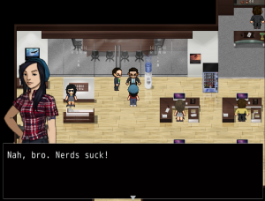

Here is yet another game I’ve played as part of the veizy<i></i>.com Steam Summer Sale Playtime 2016, it’s Always Sometimes Monsters, a cool RPG by [Vagabond Dog](http://www.vagabonddog.com/).

Always Sometimes Monsters is a game I had never heard of until news of the sequel was released earlier this year. The sequel looked cool, so I got the original a short while ago, but never got around to playing it. Until now!

In Always Sometimes Monsters you play an aspiring author who’s currently down on their luck and struggling through life. You’re behind on your rent and your landlord is understandably annoyed, so kicks you out of your apartment until you get him his money. To make matters worse, your ex is getting married at the end of the month and has invited you to the wedding! With JRPG-style gameplay, it’s up to you to perform odd-jobs like freelancing at an advertising agency, get your apartment back from the asshole landlord, and make the correct choices that will lead you to a happy life.

The game looks like an RPG from the 16-bit era, with chibi characters walking about, and more highly detailed character portraits being shown during dialogue. The game has clearly been made by only a few people, but the style of the game definitely suits it. One of the first things I did in the game was help out a musician friend prepare for a gig, and there was some awesome chiptune rock played throughout. Yeah!

I found the beginning of the game and the character selection to be really great. After a short prologue, you start the game as one character who is looking for someone at a party. The party is full of people and you can choose whomever you want, with the person you find being the main character for the rest of the game, who then goes looking for yet another person, who ends up being your character’s lover. What I loved about this was it took something very game-y, the character select screen, and turned it into gameplay. I love touches like that in games just because it shows that the creators cared about all aspects of the gamer. It also ties neatly into the game’s themes of choice and consequences, as the initial character you play as is looking for the person they plan on giving a book deal too, showing that it’s not just your choices that are important, but the choices of others to. Art!

Will I be playing more of Always Sometimes Monsters? Yeah, bro. I don’t think I’ve done a very good job of highlighting how weird and interesting this game is. It felt like I was just scratching the surface with what the game had to offer, and it was so different to most everything else I’ve ever played, I am going to play some more. Recommended.

[Always Sometimes Monsters Website](http://www.vagabonddog.com/asm/)
[Always Sometimes Monsters Steam Page](http://store.steampowered.com/app/274310/Always_Sometimes_Monsters/)
