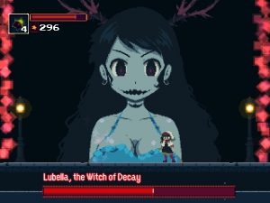

I am doing a very fine job of thematically linking the game’s I choose to play in the Veizy.com Steam Summer Sale Playtime 2016. Here’s another game with a colon in the title, it’s Momodora: Reverie Under the Moonlight! And it’s fun!

Momodora: Reverie Under the Moonlight is a Metroidvania-style game, in which you play as a small village’s shrine maiden who journeys to the capital to get help with some bad goings-on. Unfortunately for her the capital has horrific problems of its own, such as monsters plaguing the streets. It’s up to you to kill them all!

Reverie Under the Moonlight is the fourth Momodora game, serving as a prequel to the other three, but I had never heard of the series before this popped up on my Steam queue. I’m very glad it did, as this is completely what I want from gaming. The game follows typical Metroidvania tropes, you explore a 2D area with certain parts blocked off until you unlock abilities, and it’s a genre of game I thoroughly enjoy. You are equipped with a leaf as a melee weapon, but as you’re a badass it’s basically a sword, and a bow and arrow for ranged. Both feel really great to use, the sword has real weight to it, and a small combo system mixed in with a dodge roll brings some nice tactics to each fight. In the time I played I went up against quite a few bosses and they were all great, the giant lady above barged her way into a different boss fight and started throwing evil magic at me. I love it!

The art style and animations in Reverie are gorgeous. It has a pixel art style and the animations flow incredibly well. Running, jumping, sword swinging, they all look great and mesh together so well. If there’s one quibble I had with the game’s art, and I do mean quibble, it’s that from what I played, a lot of the environments were a bit grim looking. The game starts in a beautiful forest, but once you get to the monster-infested capital it changes to a very Castlevania-esque gothic style, and I felt that it was a waste of the artistic talent on display. According to the map I only saw about 30% of the world, so it’s entirely probable that things get much nicer looking later on, but I gotta judge what I see. I just gotta!

Will I play Momodora: Reverie Under the Moonlight again? You betcha! Gameplay was nice and smooth, the animations were gorgeous, it’s just a lovely game all around. I also snapped up a copy of Momodora 3 in the Steam Sale, which is exempt from the Veizy.com Steam Summer Sale Playtime 2016 rules, as it’s a game in the same series, and it would just be weird to start one before finishing the other. Yes, justification.

[Momodora: Reverie Under the Moonlight Website](http://bombservice.com/) [Momodora: Reverie Under the Moonlight Steam Page](http://store.steampowered.com/app/428550/Momodora_Reverie_Under_The_Moonlight/)
