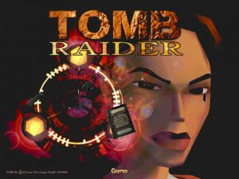
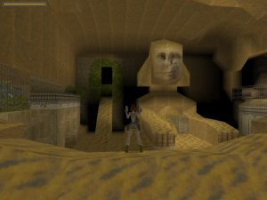
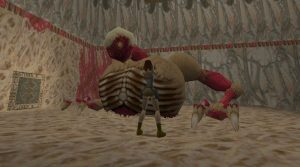

Hey, here’s a review of the first Tomb Raider game. I’m playing through all of the Tomb Raider games as part of the veizy<i></i>.com Tomb Raider 20 Years of Fun Times Retrospective. Originally released on October 25th 1996 on the Saturn, then released a few weeks later on some proper systems, Tomb Raider was developed by Core Design and published by Eidos. It’s the very first Tomb Raider game, and it holds up pretty good!

Tomb Raider is one of the earliest 3D-platformers, and really helped Sony in cementing the Playstation brand as something cool and awesome. You play as Lara Croft, a wealthy British adventurer and archaeologist who is hired to raid an ancient tomb for a valuable relic. Things quickly get out of hand as the valuable relic is technology from the long-destroyed country of Atlantis! Oh my! You have to travel the world, raiding all the tombs you can for other pieces of Atlantean technology and prevent them from falling into the wrong hands.

First things first, the game looks like ass. This is a problem with many games from the era, the video game industry transitioning to 3D happened a few years before the technology was able to properly realize the worlds that were created. It can be hard to play games from the mid 90s as the graphics are blocky and developers were still trying to figure out how to maneuver through 3D spaces. Lara controls like a tank, able to run forwards easy enough but turning her is slow and cumbersome. You have no control over the camera so have to hope that it follows you properly. Thankfully it manages the task often enough, but in tight spaces it can become cumbersome.

One of the early things that really stuck out to me is how the vast majority of enemies are animals, not humans. You only fight a handful of human enemies in this, and hilariously one of them is riding a skateboard. Quit a few of the human fights are against the same guy, who you shoot a bunch and then he runs away, really emphasizing the fact that you don’t want to kill another human. I remember reading an interview with the creators of Tomb Raider who said they did this because they thought a game where you kill other humans could be seen as too violent. It’s quite an interesting decision to look back on as nowadays the inverse would be true; a game where you mostly kill animals could be seen as needlessly sadistic. I will make a mental note to see what changes, if any, the remake Tomb Raider Anniversary has in this regard.

I also liked the idea of the different enemy types starting as simple animals, and then getting crazy weird monsters as the game goes on. It’s quite shocking when first attacked by an Atlantean, as you walk past a couple of creepy looking statues earlier in the game, so when one of them suddenly comes to life and shoots monster goop at you it’s totally unexpected. However, I think adding DINOSAURS to the first few levels of the game really ruined that ramp-up. There aren’t many places to go after killing a T-Rex in level 3. If that stuck to regular animal like wolves and gorillas before encountering the Atlantean, it would have been extra shocking and a completely unexpected twist.

The level design of Tomb Raider is impressive for it’s age. Care was taken to make the different levels appear like actual locations that had fallen into disarray. I found some parts technically impressive as well, as there are times where the level geometry is altered through your actions. One puzzle involves you setting off an explosion to clear a path. Nowadays I wouldn’t think anything of it, but for the time it’s crazy they pulled it off.

One aspect where I feel the level design is let down, is by having ideas that couldn’t really be properly accomplished with the control scheme. One level (St Francis’s Folly) has a section which involves you going up and down a tall vertical space, pressing switches at the bottom to open doors at the top. It’s a cool idea that’s let down by Lara’s janky platforming. The vertical space is an interesting change of pace, but the controls make the whole thing quite difficult to navigate. There are a few other jumps throughout the game that are only hard because of the control scheme, and I don’t think that’s a good method of game design. It really annoys me when doing something in a video game is hard if it’s something that would be trivial to do in real life. This occurs a few times throughout Tomb Raider, and I didn’t like it!

Some puzzles did get quite obtuse the further into the game you got. There was one part in Natla’s Mines where you had to pull a switch which opened a door, through which was another switch that opened a door next to where the first switch was. I’m all for running about the entire level searching for what to do, but that puzzle stood out as needless busy work. It probably didn’t help that I died just after doing all that so had to do the whole process all over.

Tomb Raider holds up much better than I was expecting. The controls are very janky and take a lot of getting used to, but once you do there is a quality game to be played. It’s also impressive for its age, and I do think it’s a game everyone should play through at least once, just to see how an entire genre of video game began.

I played through the Steam release of Tomb Raider, completing the game in about 10 hours. I, very regrettably, twice resorted to a walkthrough. Once in the Midas room as I tried to figure out how to use the golden hand, and again in the Cistern as I couldn’t find a key. I am ashamed. I vow to not use a walkthrough for any of the other Tomb Raiders. Unless I get really, really stuck. After much fiddling about with config files and patches I got the game running at 4K. Which was lovely. I played using the keyboard, I wanted to use the controller but couldn’t get it working natively, used a keyboard-controller spoofer thing that worked but felt off, and then resorted to keyboard. I shouldn’t have wasted the time as after a few levels the keyboard controls were just fine.

[Tomb Raider (1996) Steam Page](http://store.steampowered.com/app/224960/Tomb_Raider_I/)
