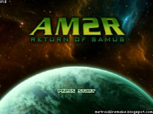
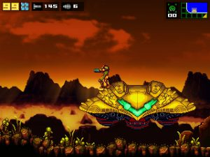

A few weeks ago, a free fan remake of [Metroid II](https://en.wikipedia.org/wiki/Metroid_II:_Return_of_Samus) was released. AM2R, standing for Another Metroid 2 Remake, was in development for 9 years before being released on the 30th anniversary of the original Metroid game. Nintendo were not happy that a bunch of fans were celebrating the Metroid franchise that they’ve worked [so hard](https://en.wikipedia.org/wiki/Metroid:_Other_M) [to ruin](https://en.wikipedia.org/wiki/Metroid_Prime:_Federation_Force), so issued a bunch of DMCA takedown notices towards everywhere hosting the game. Of course, getting a copy of the game is still incredibly easy, so I did, and I have played it! It’s great!

The original [Metroid](https://en.wikipedia.org/wiki/Metroid_(video_game)) was released on the NES  back in 1986, a 2D action-platformer which broke new video game ground with its kickass atmosphere and female protagonist. [Super Metroid](https://en.wikipedia.org/wiki/Super_Metroid), released on the SNES in 1994, is one of the most beloved games of all time, topping numerous Best Game Ever lists for its excellent gameplay, level design, and invention/refinement/popularization of an entire genre of video game, the [Metroidvania](https://en.wikipedia.org/wiki/Metroidvania). Metroid II was released in 1991 on the Gameboy, sandwiched between those two behemoths, and has basically become a forgotten relic of the series. I played Metroid II a few years after its release and found it to be somewhat pathetic. The Gameboy just couldn’t do justice to the atmosphere of the original, and the sublime controls of the series didn’t translate to the mobile form factor. I can’t imagine many people had fond memories of Metroid II. The team behind AM2R clearly had plans to change that, by creating a remake of the game to bring it up to the graphical and gameplay standards of Super Metroid, even taking some cues from the later 2D Metroid games Fusion and Zero Mission. Metroid.

The Metroid franchise is one of the most beloved in gaming, so it’s strange that Nintendo have worked so hard to sabotage it. The last Metroid release was [Metroid: Other M](https://en.wikipedia.org/wiki/Metroid:_Other_M) on the Wii, a ridiculous game of endless cutscenes with horrible writing, and the upcoming [Metroid Prime: Federation Force](https://en.wikipedia.org/wiki/Metroid_Prime:_Federation_Force) is some sort of co-op shooter. The last proper Metroid game was [Metroid: Zero Mission](https://en.wikipedia.org/wiki/Metroid:_Zero_Mission), which released in 2004, THREE console generations ago on the Gameboy Advance. Nintendo know that people want to play a real Metroid game, yet don’t ever want to make one.

With the backstory out of the way, it’s time to talk about the game. AM2R is a 2D action-platformer, unsurprisingly of the Metroidvania variety. You play as Samus Aran, a female space bounty hunter who is tasked with travelling to the planet SR338 and exterminating all of the Metroids, horrible alien creatures that pose a huge danger to the entire universe. Your main task in the game involves exploring the planet and killing Metroids, after killing enough of them the next area of the planet will unlock and you can kill some more. You get a huge number of powerups throughout the game, giving you stronger weapons, new skills, and snazzy new outfits.

There isn’t a huge amount to actually say about AM2R other than the fact that it’s amazing. It looks great. It really does look like Super Metroid, and it feels pretty similar too. There is little, if anything, in this game to make it feel like a fan-made effort, and not a full scale release. The level design is great, I’m not sure how much has been carried over from the Gameboy Metroid II, from the few comparison videos I’ve seen there are some similarities but the original has been treated more like a guide then as an actual blueprint for the remake. As mentioned above, I don’t think Metroid II was a very good game, so AM2R turning it into a great game has thoroughly impressed me. It wasn’t until I played AM2R that I realised how much I’ve missed playing Metroid. I am a fan of the genre so I knew I would like this game, but I didn’t know how much I would love it. It’s been a long time since the last proper Metroid, and AM2R has rekindled my love of the series.

My only real gripe with the game were the fights against the Metroids. You fight about 50 Metroids throughout the game (there’s a handy counter telling you how many are left to kill) and I didn’t enjoy any of them. The Metroids come in 4 different forms, all with the same glowing weak point on their belly, but getting progressively more vicious as you go through the game. What should have been exciting fights as you try to manouever yourself into the correct position to deal damage, instead were petty annoyances against enemies who tried their darndest to stay below you. My main tactic in all of the fights ended up being running face-first into them in the hopes I could hit them point blank. Even the weakest version of the Metroids I fought this way, because they never flew above me, making shooting their underside near-impossible. I wouldn’t say I hated these fights, but they seemed so much worse than every other aspect of the game. All proper boss fights of the game were awesome, including the end boss fight against the Mother Metroid, I just wish the standard Metroids which you fight so often were more entertaining.

On the whole, AM2R is fantastic. You can tell this isn’t as ultra-polished as an official release, but it’s pretty darn close. The years of effort put forth by people who clearly care strongly about the Metroid franchise is fully on display, and it’s disgusting that Nintendo don’t give a shit about any of that. If you are a fan of the Metroid series you should play this, if you’re a fan of the Metroidvania genre you should play this, and if you’re a fan of great games you should play this. Just play this.

I finished AM2R with an 80% completion rate and an in-game timer of 4 hours 40 minutes. That timer seemed very generous and it didn’t count the times I died, so my estimation for an actual playtime would be over six hours, if not closer to seven. I plan on backtracking through the game and getting all the missing items for 100% completion.

[AM2R Website](http://metroid2remake.blogspot.co.uk/)
