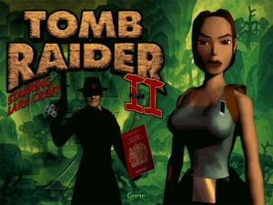
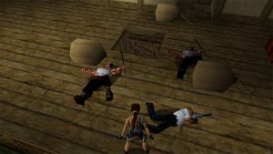
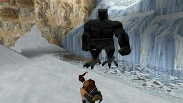
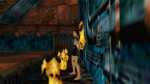

I’m playing through all of the Tomb Raider games thanks to the veizy<i></i>.com Tomb Raider 20 Years of Fun Times Retrospective. This here is Tomb Raider II, and it’s jolly good. It was developed by Core Design, published by Eidos, and originally released in October 1997.

Tomb Raider II is great and should be remembered as one of the great video game sequels. It refined as many elements from the first game as it possibly could, it is overall more polished, and it is a joy to play that still holds up today. It keeps the same tank control scheme from the first game and subtly improves on it. The base movements have been improved, Lara’s starting and turning speeds have both been tweaked to feel more responsive, jumping feels ever so slightly tighter, and movement on the whole feels nicer. Starting the fine Tomb Raider tradition, Lara has a couple of new moves, in Tomb Raider II she can climb ladders(unfortunately very, very slowly), ride zip-lines, and drive vehicles. In Venice you can ride a speedboat, and in the Himalayas you get to ride a ski-mobile. Both are confined to single levels and are surprisingly fun to use. In general I am against “vehicle sections” in games, but the vehicles in Tomb Raider II actually integrate themselves into the puzzles. Plus you get to pull off some sweet jumps with both, so I approve.

Graphics have also been improved from the first game. This is still 1997 technology so it’s nothing mindblowing, but huge leaps have been made since the first game that really make you realise how quickly graphics were progressing back in the day. Lara herself has a flowing ponytail as opposed to the weird block of hair she had in the first game, levels in general are much larger with wide open spaces, and level geometry is less blocky. It’s still on the same grid system, but the squares of the grid look nicer. Yes, nicer squares.

In huge contrast to the first game, and the comments I made when reviewing it, the vast majority of enemies in Tomb Raider II are other humans. Unlike the first Tomb Raider where you only fight about three actual people with the rest of the enemies being animals or monsters, other people are the prime threat in Tomb Raider II. It is an interesting contrast between the two games. This also extends to the more real-world locations featured in the second game. All of the levels in Tomb Raider I were ancient ruins, in Tomb Raider II you don’t visit any ancient ruins until the very end of the game. The storyline of Tomb Raider II sees Lara battling against the Italian mafia in a race for an ancient dagger with magical properties, and it’s these mobsters who are the primary enemies throughout the game. And they don’t just melee you, a whole bunch of them have guns. The enemy progression does follow the same as the first, with more supernatural enemies appearing later on in the game, and a Tyrannosaurs Rex showing up in the first level for no blooming reason.

The game is quite a bit longer than the first but I felt it dragged a bit in the middle. There are a series of levels where you investigate a wrecked ship that’s at the bottom of the ocean. It’s really cool, but you spend about five levels down there, and I think it got a bit tedious. The game also got a bit too weird at the end, much like the first game. The last level in Tomb Raider I was some weird meat castle, with fleshy walls and general ickiness. In the last level of Tomb Raider II you go underground and find a bunch of weird, multi-coloured floating islands. It seemed so out of place, and wasn’t very fun to play. I appreciate the descent into weirdness as the game goes on, but it felt like they didn’t really know what to do for a final level, so just put out whatever they could.

Random thoughts. The end boss of the game is a giant dragon. It’s awesome. You also fight a giant bird man a couple of levels earlier who looks silly and stupid. Killing him was great. The final level has creepy, floating samurai who shoot green goop at you. They are also very cool.

Spoilers I suppose, for the end of the game, but the very last level of Tomb Raider II is amazing. It’s a short epilogue where Lara is at home getting ready for bed when a whole bunch of mobsters show up, angry that you killed their boss. You then have to defend yourself as they storm Croft Manor. It’s an awesome way to end the game, and something very few games ever do.

The biggest downside of Tomb Raider II for me was the puzzle design. In the first game there were acceptable levels of suspension of disbelief for the obtuse puzzles, as they were left to guard ancient secrets in the various tombs you explored. However, as previously mentioned the majority of Tomb Raider II takes place in real-world locations, so it makes very little sense that the key needed to turn off an oven would be in a secret room hidden behind a painting that you can only access by clambering over chandeliers which first you have to raise and lower to get in the right position. Of course, quibbling over borderline issues like this is the entrance to a rabbit hole I certainly don’t want to go down, but it is a bit of a let down considering how much work was put into the game’s locations.

Tomb Raider II holds up amazingly. It improves a lot on the first game, and I highly recommend everybody play through it. It’s quite tough, but rewarding. You fight a dragon! What more do you want!?

I played Tomb Raider II on Steam. According to the in-game timer I finished it in eleven and a half hours, according to Steam it took sixteen. I guess that means there where four and a half hours of dying. Nice. Much like the first game there was annoying technical faffing to get it to work on Windows 10. Even after loads of hassle I never got the game running fullscreen, and instead it ran in a 1080p window. Also the screen freaked out whenever there was a pre-rendered cutscene. Curse you old game! Curse you!

[Tomb Raider II Steam Page](http://store.steampowered.com/app/225300/Tomb_Raider_II/)
