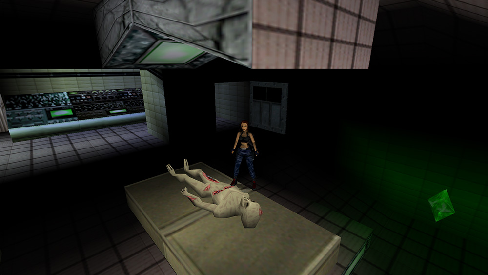
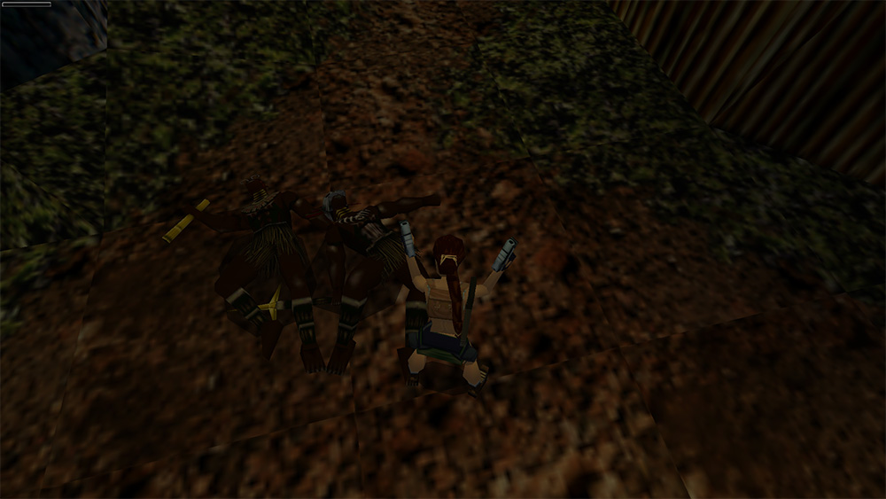
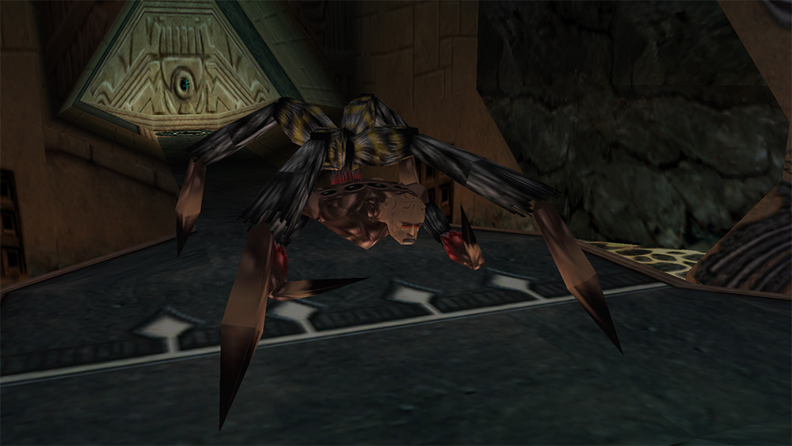

I’ve just finished playing Tomb Raider III, as I’m playing through all of the Tomb Raider games as part of the Veizy.com Tomb Raider 20 Years of Fun Times Retrospective. Tomb Raider 3 was released in November 1998, developed by Core Design, and published by Eidos. Tomb Raider!

Tomb Raider III sticks to the Tomb Raider formula that was successful for the past two games. It’s a 3rd person action-platformer, with levels based on a chunky grid system, through which you jump and shoot your way to glory. Tomb Raider III: Adventures of Lara Croft, to give it its full title, sees Lara stumbling across a weird artifact in deepest India. An overly-friendly Welshman tells Lara that her artifact is part of a set, with three more hidden throughout the world. It’s up to Lara to collect all of the artifacts, then be inevitably betrayed by someone she thought was her friend. The first few levels take place in India, the last few take place in Antarctica, and the middle section has levels in London, the South Pacific, and Area 51. You can choose which order you do those three, which is a neat idea but doesn’t really have any effect on gameplay.

The new moves this time around are crawling, sprinting, and monkey bar swinging. I found the monkey bar mechanic to be quite forgettable. There were a few puzzles throughout the game that I got completely stuck on, as I had forgotten all about the monkey bars. Swingable areas were rarely highlighted as such, so it took a while for me to get used to looking up and checking the area for swinging. Sprinting had a similar issue but that problem was usually resolved much quicker, if I tried running through some trap and didn’t make it in time I remembered that I could sprint and did it again successfully. These problems are probably due to me playing all the Tomb Raider games one after another, and not really taking the time to appreciate the new mechanics. Maybe.

The game doesn’t stray far from what has come to be expected in Tomb Raider games, but there are a few cool graphical upgrades. There’s now dynamic coloured lighting effects, which are probably overused, but you can see the green glow from the crystal in the screenshot above. Bullet casings from your gun now fly out and linger on the ground for a few seconds, which is quite nice. Levels are also much, much bigger than before, and have wide open areas. There are also a couple of new vehicles to play with. There’s a kayak for paddling down some rapids, an underwater propulsion vehicle for faster swimming, and an amped-up quad bike. I completely missed the underwater thing when I first saw it, as I just assumed it was part of the scenery so didn’t try using it, it was only later in the level when you pretty much need it to go down a long underwater corridor without drowning that I realised it was a vehicle.

The game has less combat than was in Tomb Raider II, and you also fight a wider variety of enemies. You do murder a whole bunch of humans, but there’s also many animals that Lara ends up murdering. Tomb Raider II was very combat heavy, so it’s nice that the game has reeled it in somewhat, with more puzzle solving and platforming to make up for it.

There’s also a good mix of different locations to go to, however London was by far my least favourite area. I’m unsure if the different areas were designed by different people, but I hated London. You start on a rooftop, break through into an abandoned tube station, swim through flooded sewers before finally surfacing in an office building. I hated all of it. The first London level had too much slow, vertical movement that I got incredibly annoyed. I ended up climbing the same ladder about 5 or 6 times due to switches sending me all over the place, and ladder climbing is so slow. I also hate water levels, and there was a big one. Having said that, the boss of the London levels was awesome. You chase a businesswoman up the side of a building as she shoots energy bolts at you. It was short and fun, and unlike any of the other boss fights in Tomb Raider up to this point. The end boss of the game is also great, he is a giant spider monster who looks awesome. I am noticing the trend of the end boss of each Tomb Raider being a human who transforms themselves into a giant monster form, almost like the Resident Evil games. What a satisfying connection between two game franchises.

I played Tomb Raider III when it first came out but didn’t really remember it too well, so I was quite shocked at some of the parts during the game. The levels set in Area 51 see Lara breaking into the famed military base, causing a prison riot, and killing a whole bunch of military personnel. A AAA-game could never be released today with that sort of content, so it comes across feeling very weird. They don’t even try and explain away Lara’s actions, like that maybe the base is run by a corrupt military general who surrounds himself those loyal to him. It is literally, Lara wants to steal something from a military base so she goes in, kills a bunch of people, and then takes it.

Things stay political in the levels set in the South Pacific, which see Lara laying waste to a village full of dark-skinned tribesmen, complete with tiki masks. It is weird playing a AAA release game with these sorts of things in, especially after [the Resident Evil 5 nonsense](https://en.wikipedia.org/wiki/Resident_Evil_5#Allegations_of_racism) from a few years back scared developers off from including racially-sensitive situations. The game is 18 years old, and it’s interesting to note the shift in what is and isn’t acceptable.

What I found most interesting is how this paints Lara Croft as a character. This isn’t a Tomb Raider II situation where Lara was fighting against the mafia so it’s morally acceptable to kill them. All of the human deaths in this game are because Lara knowingly trespassed in a place she didn’t belong, and then killed the people there. I know I am reading far more into this than I should, but nowadays there are stories in games to justify all of the killing. This being released during the time period before story became an important part of game design makes it an interesting experience.

Tomb Raider III follows on from Tomb Raider II well. There’s much less combat, the levels are bigger, and it adds a couple of new things. The graphical progress of the series is really impressive, the Tomb Raider games were released yearly at this point, and all on the original Playstation, and it’s crazy how much better Tomb Raider III looks compared to the first. I started playing TR3 right after I finished TR2 and I couldn’t really get into it, probably due to Tomb Raider fatigue. After not playing for a couple of weeks I tried again and was hooked. I don’t think 3 is as good as 2, but it is still a great game and holds up well.

I played through Tomb Raider III on the PC. The in-game timer listed my total playtime as thirteen and a half hours, but that didn’t count the numerous times I died. I would add a couple of hours on to get my actual playtime. I didn’t play through Steam so don’t have a more accurate time to compare to, as I used a hack mod to get it running in 1080p widescreen. Old games is hard to play, man.

[Tomb Raider III Steam Page](http://store.steampowered.com/app/225320/Tomb_Raider_III/)
