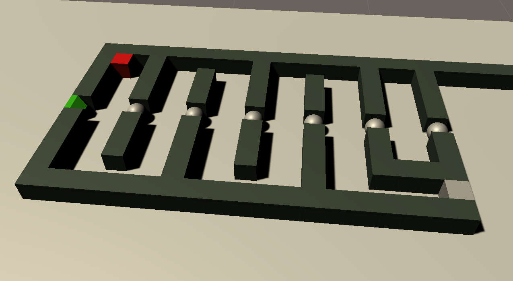
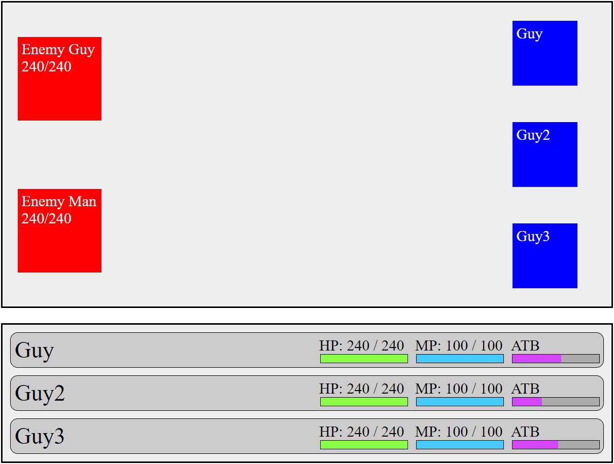
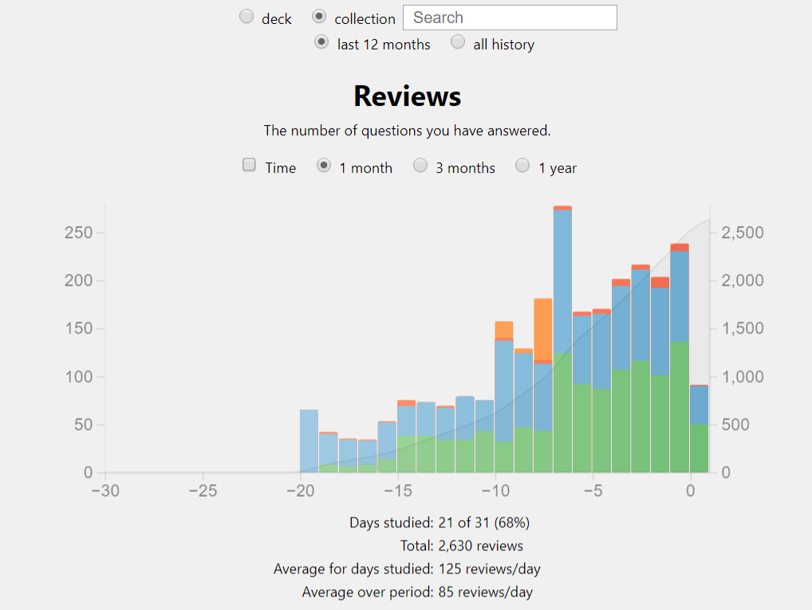

Hi veizy.com!

I haven't used you in forever, and again I've forgotten to turn off auto-renew, so I have to try and make use of you.

Since covid started I have been furloughed off and on throughout, with probably close to 50% off my time being on furlough. I had all of April 2020 off as furlough, and like most people in the same situation I took it as an unexpected holiday. I thought the whole thing would be over soon enough and I should make the best of the situation.

However, as the months progressed it became clear that we were in this for the long term, and that I should probably try and use my given furlough time productively. I worked throughout all of May and June, but then got a chunk of furlough in July and August, so decided to start undertaking furlough projects. These continued when I returned to a more regular work schedule of three and four day weeks, using my furlough days each week to do projects.

As I now have my biggest chunk of furlough since last August(nearly three weeks off over Easter), I've decided I should upate this website, and also log all of the projects I've done. Please enjoy!

## Static site with Jekyll - July 2020

My first furlough project was to try and make a static site using [Jekyll](https://jekyllrb.com/). I hadn't made a static site before, and had been wanting to publish something to [Netlify](https://www.netlify.com/), so I did! I copied a concept design for a pro wrestling stats website, and decided to try making the site. Jekyll was quite easy to use, but completely unsuited for the task I gave it.

I put match results in to a bunch of yaml files, Jekyll read the files and calculated win/loss records, then generated pages for each wrestler. It did work, but the sort of cross calculations I wanted didn't gel with a static site. As this was an exercise in making a static site, and not an exercise in making the wrestling stats site, I didn't want to use javascript or anything else that would have made things easier. I also didn't bother with finding info on all the wrestlers to complete the site properly, and abandoned the project.

I learnt how to use Jekyll, and made a site that should not have been made in Jekyll. It was fun! Check out [AEW Fun Stats](https://aew-fun-stats.netlify.app/).

## 3D modelling with Blender - August 2020

Learning 3D modelling has been something I've wanted to do for years, and after a video on Blender serendipitously showed up in my YouTube feed, I decided to make it my next project.

[Blender](https://www.blender.org/) is a free 3D modelling program that has most of the features of the super expensive software, and is quite easy to use. I spent about a month following some tutorials and making my own things in Blender, but unfortunately a hard drive crash meant I lost all of the files I had created! All I have to show for this work now are the renders I posted to Instagram.

### Donut

\[video src=http://192.168.1.148/wordpress/wp-content/uploads/2021/03/Donut.mp4\]

I followed the [Donut tutorial](https://www.youtube.com/watch?v=TPrnSACiTJ4) by Blender Guru and found it surprisingly easy to follow along with. It took a fair few hours over multiple days, but I ended up with a reasonable donut! I wasn't expecting it to be as simple to make something so nice looking.

### Chair (and donuts)

\[video src=http://192.168.1.148/wordpress/wp-content/uploads/2021/03/Chair.mp4\]

This was a total faff! The chair itself took a couple of days and went easily enough, as I followed another Blender Guru tutorial. But I wanted to try something extra as well. I copied the donut from the first tutorial, and made a whole bunch of them, with random colours on top. I then figured out how to apply physics to them and tried to make it shower donuts. They came down in waves because I copy/pasted them in big groups. I could have fixed it, but it took ages to calculate the physics and at some point I had to accept the result. Unfortunately it gets too dark at the end because I didn't check the lighting properly, and as it took 6 hours to render the whole video I wasn't doing it again! This was really fun to do.

### Guitar

After a couple of other tutorials I tried to make something from scratch, and decided on a guitar. I took reference photos of my own guitar and set to work.

There are a few bits that were a complete bodge, the neck connecting to the headstock didn't fit because they had different numbers of vertices, and the audio jack took ages because I didn't know how to cut a hole out of the body properly. It's something that I thought should be simple, but adding extra points kept breaking it!

Once it was done, I made the strings vibrate but you could barely even see them moving, so had them light up as well. I then recorded some sound to go along with it, and voila!

\[video src=http://192.168.1.148/wordpress/wp-content/uploads/2021/03/Guitar.mp4\]

You can't see it very well in the video, but the guitar is contoured as an actual guitar is, and is properly high-quality! I modelled all of the frets and the fret dots, the pickup coils are all the exact heights, the strings are the right thickness, the volume knobs have all the numbers and the correct fonts on them! Looking back at it now I think I missed the pickup switch, but I know I was getting very annoyed with this by the end.

As the camera spins around the guitar you can see a black sky. This was an image of space I got from Nasa. They have an [awesome image library](https://hubblesite.org/resource-gallery) you can download from, so I downloaded a 100mb starscape file, figured out how to make the stars in an image emit light and then in the finished video you can't even see them!

After finishing the guitar, I wanted to try and make an interactive version, so you could press frets and play the strings, which led into my next project.

## Laser game in Unity - September to October 2020

One of the reasons I wanted to learn 3D modelling is so I could make my own models and try and make a video game in [Unity](https://unity.com/). I spent a day following a tutorial that taught me the Unity workspace and then set out on my own. I wanted to make a simple game about pushing blocks and bouncing lasers off of mirrors. As I had no clue what I was doing I has to throw everything out and start from scratch multiple times.

I think I was finally getting somewhere with it but after literally my fifth restart I gave up. I wasn't on furlough much through the autumn so only had weekends to work on this, which meant I could never get into a good flow. It got very discouraging having to restart so many times and I got sick of it. I'm going to have another go at this at some point, but really need to devote a bigger block of time to learning Unity properly.

You can play one room of this [here](https://superdrdood.github.io/lasergame/).

## Dokuwiki - November 2020

All of my creative ideas are currently in text files on my computer. I had been meaning to sort them differently for years, but never really bothered. I then had a hard drive failure (as mentioned above!) that made me want to think up a better way of handling this.

After a whole bunch of research I decided to install a local wiki on my NAS called [Dokuwiki](https://www.dokuwiki.org/dokuwiki), and it makes daily backups to google drive. I'm now going to put all my ideas into this, and allow them to crosslink with each other. This will also timestamp when things were thought of, and also allow me to meta-notes about anything.

I also wrote a very simple wordcount plugin for Dokuwiki, more to see if I could than anything more. I can, and it works!

## Video game text size fun - November 2020

This stemmed from a problem I had over a year ago when trying to play Outer Worlds on my tv, the text size was too small! This has happened previously with loads of big games, and I'd always wanted to look into it to see if I was just blind, or game companies are rubbish. It's the later! I ended up doing a whole bunch of research on tv sizes, eyesight, optimum viewing distances, and all in-between. I have done a 3000 word write-up, with more to come. This got halted around Christmas time, but I'm going to pick this up and publish on veizy when I'm done.

All of the research and most of the writing is done, but I want to make up some graphics to go along with it and haven't found the energy to do them yet. This is something I'm going to return to and finish in the next few weeks.

## Video game tracker - December 2020 to January 2021

At the end of last year I saw someone do cool visualisations of the video games they had played over the year, and the dates they had played/completed them. It looked neat! For a few years I have been tracking all the media I consume in a big spreadsheet. Putting dates against watching films and tv shows is easy enough as they are one-off things, but video games can take days or weeks to play through. I didn't want to muddy the spreadsheet up and put down every single day I played a game, so I was only tracking completions. However, this means I don't know how much I played each game.

I made a quick little site in php where I could input games, one-click to add dates I've played and completed, and then once I have lots of data I can make some cool visualisations. I only have three months of data right now so I'm not too concerned about the visualisations yet, but once it gets to the end of the year I will plan on presenting the data in interesting ways.

The site currently works, and runs locally. As it has no protections I don't want to put it online, but I would be interested is outputting all of the data to veizy somehow. Probably once a day send the file up or something?

Also, it looks terrible right now. I wanted something that worked rather than something that looked nice so put off any actual design work. You can see in the screenshot it doesn't handle game names over a certain length, which is just one of the many design issues.

Also also, the backend dumps all the data in a simple text file that is formatted terribly. Each line has the name of a game, a date, and the status for that date. It works, but it feels quite hacky and there are lots of extra things I would like to add. For example, you can't easily rename games currently, and it re-writes the entire file whenever anything is saved. I plan to switch to storing it as some sort of structured data when I get round to it, so I can also add meta-information to each game, like what system it was played on.

## RPG battle system in javascript - March 2021 to current

I recently played through Final Fantasy 9 for the first time, and it was amazing! It got me very nostalgic for the battle system used in the PSX-era Final Fantasy games, and wondered if I could make it myself. So I did, in javascript.

I have watched a whole bunch of Coding Train videos recently, and I've been trying to move on from my overreliance of jQuery, so this is all native Javascript,

This is still in progress and is going nicely. The basic framework works as once your ATB reaches maximum a popup lets you choose what to do, and currently you can attack for light damage, or magic attack for high damage at mana cost. All of the guts are in place, so now it's a case of adding all of the different attack options, and making the enemy attack back.

My end goal for this would be: you pick a few pre-determined party members with their own skills, then pick an enemy group to fight. You could also set levels for each, as implementing stat scaling sounds both fun and easy. I have no desire to turn this into a full game, this was a fun exercise in making the battle system.

## Japanese language - March 2021 to current

I graduated from university with a degree in Japanese over 10 years ago, and have barely used any of the language since. Getting better at Japanese has been on my list of things to do for years, and now seems as good a time as any. I've found I haven't forgotten much grammar, but my kanji has always been awful and now it's worse, and vocab has become spotty.

I am putting all the vocab from my old Japanese kanji workbooks into [Anki](https://apps.ankiweb.net/), and learning with that. I am up to about 120 kanji with 400ish vocab words in just under 3 weeks. I haven't technically learnt anything new yet, just going over things I had forgotten. It is really interesting in how I look at a kanji, not know it at all, but once I find out what it is the neurons in my brain re-awaken and I can easily remember it. This is true for both reading and writing kanji. I'm obviously not going to be able to keep up the pace when I start getting to kanji I'm less familiar with, or don't know at all, but I read a stat that the most used 1000 kanji make up 95% of all used, so I'm not too disheartened at having to learn all 2000 jouyou kanji. I'm also aware this is going to be a long process.

I'm currently taking from Basic Kanji Book 1 and 2, which cover 500 kanji, and somewhere between 1500-2000 vocab. Once they're done, I'll switch over to Kanji in Context, and take all the vocab from there. Decks are split between reading and writing, and I study writing in the morning, and reading in the afternoon.

Just looking at flashcards isn't going to be enough though, so I'm also going to commit some time each day to Japanese immersion, which is a fancy way of saying I'm going to play through some games in Japanese.

Action Button did a [six-hour review of Tokimeki Memorial](https://www.youtube.com/watch?v=xb-DtICmPTY) that made me really want to play that, and it was never released outside Japan. I think getting my Japanese up to the ability to comfortably play through that is my current goal, but I'm going to need to up my kanji a bit before starting that.

Instead I have started Zelda: Link's Awakening in Japanese, and think that would be a fun game to go through as it's quite easy language and there's no kanji! I'm playing through the GBC version, but may play through the Switch version as well and compare them, and then write a blog about the experience! I played Link's Awakening back in the 90s so remember barely anything about it, but it's quite fun so far!

I may play through the entire Zelda series, as one of the games I played when at university was the Japanese version of Phantom Hourglass, and found that good practice at the time.

Just sheer time spent using a foreign language is one of the main things you need to do to become competent, so I'm going to keep playing Japanese games from now on. Not every game I play will be Japanese, but I'll always have one on the go! I'm also not too bothered about increasing my other language proficiencies, I am currently only doing this so I can play video games and read some books.

## Upcoming

I am currently on a three week furlough, and once that's over I expect to be on some amount of part-furlough until the scheme ends in September, so have some other projects planned.

### A redesign of this website

I've found I'm not great at reviews in the typical sense. I much prefer talking about things that interest me than trying to give a critical analysis on something. "Here is something I like and it's possibly for this reason" rather than trying to justify it. So I'm not going to be doing them any more.

I'm also going to keep my furlough projects updated, properly put them onto github, and then host the finished things here instead of there.

I am not a fan of the layout of the site. Not knowing what I want the site to look like is a bummer, so I'm going to figure that out.

I'm also going to write some plugins that I've been after for a while. These things may exist, but I've never wrote a proper Wordpress plugin before so I'm going to give it a go. I want something that can auto-generate any references and create a list of all of them at the bottom of a post, with anchor links to where they are. I also want to make an auto-contents of a post, that generates links to each sub-heading. I was going to do it for this post, but it's a pain to do manually.

### A return to Unity

I plan on returning to Unity and getting somewhere with the game I attempted at some point! I have a number of ideas for it, and I think I've got my head around the code logic a bit better.

### Music

I backed a sweet customisable guitar pedal called the [Mod Dwarf](https://moddevices.com/products/mod-dwarf/) on Indiegogo last year, but covid broke their supply lines so have no idea when mine will actually arrive. It was originally stated before Christmas, but now they've only said it won't be Q1 this year. Here's hoping to early Q2 but I'm not holding my breath.

When that arrives I plan on trying to record more music and get somewhere with it this time. I haven't really touched my guitar in the past year, and I'm going to try and rectify that!

## Conclusion

Covid has been a bit pants, but the furlough situation I've found myself in is something I want to take the greatest advantage of, and try and be productive about.

Thanks for enjoying!
