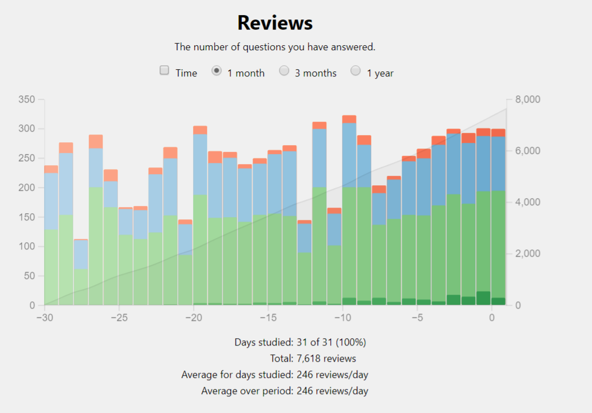

I figured I would do a fun update post each month about how my Japanese is progressing, as it would give me a little bit of time to reflect on where I am and also generate content for the machine. The machine always needs feeding, and it hungers for content. So here is where I'm up to with Japanese learning in April 2021.

## Kanji flashcards are your friend and mine

I have continued studying with [Anki](https://apps.ankiweb.net/) every day adding 20 new vocabulary from [Basic Kanji Book](https://www.amazon.co.uk/BASIC-Bundle-Japanese-Original-Sticky/dp/B07B4R583W/ref=pd_lpo_14_t_2/261-8948087-5680704?_encoding=UTF8&pd_rd_i=B07B4R583W&pd_rd_r=4297f551-1e9a-4c12-9b7d-e87f4cbe5e04&pd_rd_w=5dm23&pd_rd_wg=n0NfT&pf_rd_p=3366510f-1771-44b5-99e2-20c1889506ac&pf_rd_r=QBQCCK5B5VJVR4A8GNQ0&psc=1&refRID=QBQCCK5B5VJVR4A8GNQ0). I've finished Book 1 and am up to chapter 26 in Book 2 (chapters carry over from Book 1 to 2, so I'm actually only four chapters in to Book 2). I practice writing in the morning, reading in the afternoon, and then a quick review of everything I got wrong that day in the evening (which I often skip!). If you don't know what Anki is, it's a flashcard app that increases the interval before you next see a card if you get the card correct, but resets the interval to 0 if you get it wrong. I don't want my evening session to affect these interval stats so I have to do a roundabout way of making a custom study deck of cards I missed, then preview that deck in deck browser. It's a bit of a faff.

I have reading and writing split into different decks, with my writing deck currently taking 30-40 minutes to go through, and the reading deck taking 5-10 minutes. I would very much like to keep the both of them up, as the writing definitely helps the reading. If I just spent the 5-10 minutes on reading a day I am certain I wouldn't be making the progress I am.

The most laborious thing about this process is adding new cards to Anki. I prefer to make my own decks rather than to use someone else's, even if they did have the exact vocab and layout I wanted, because I can use the adding time to review what's coming up. It takes about 10 minutes to add a chapter, and I'm currently going through 3-4 chapters a week. It isn't a huge time investment, but it is super dull!

### Stat crunching

This graph shows how many card reviews I studied each day, going back 30 days. The line in the background shows total number of cards reviewed.

- Dark green are mature cards, which means they have an interval greater than 21 days.
- Light green are young cards, which means they have an interval less than 21 days.
- Blue are new cards, which means I haven't seen them before. Blue appears much larger in the graph than the actual number of cards, because the graph is showing reviews and you have to get two reviews correct before it increases the interval to the next day.
- Red cards are relearning, which means I got them wrong the previous day.

You can see from my stats graph, on the days when I actually remember to do all the studying the amount of cards I study stay reasonably constant. There were a few days at the beginning of the month where I completed all the cards I had added, and didn't get round to adding any more. There are also a few days where I missed the afternoon reading practice which meant my writing got ahead. I find it much easier to learn how to read a kanji before learning how to write it, so I set my writing decks down to 10 new vocabulary a day to let reading catch back up. I've now managed to align it, so the 20 new reading cards I learn in the afternoon are the 20 new writing cards I get the next morning. The placebo synergy this creates in my brain is very satisfying, and makes it feel like I'm learning on overdrive.

Even though Anki keeps all of the stats, it doesn't make it super easy to see what percentage I got wrong over the past month. I could probably work it out, but just going by today I got 10 wrong in my reading, and 12 wrong in my writing, which averages at 7%. I think this is acceptable, as I know most of what I get wrong are things that are relatively new. There have been a few problem vocabulary that kept on tripping me up, but I've solved all of them up to now. These are usually vocabulary that use a unique kanji that won't be showing up for a while. 「期待きたいする」and「招待しょうたいする」were my nemeses for a huge chunk of April, but I've got them down now.

And here are some numbers regarding reading stats:

- Total kanji learned: **297**
- Total vocabulary at each level:
    - Mature: **538**
    - Young: **415**

## Japanese Consumption

Outside of studying kanji flashcards, I'm also consuming media in Japanese to help with the language. Yes, I count playing video games as studying, it is 100% legitimate!

### Japanese games I have played in April 2021

- Legend of Zelda: Link's Awakening DX on Game Boy
- Legend of Zelda: Link's Awakening on Switch
- Youkai Watch on Switch
- Professor Layton and the Mysterious Village on DS

I made [a blog post about my playthroughs of Link's Awakening](http://192.168.1.148/wordpress/2021/04/19/the-legend-of-zelda-links-awakening/). There wasn't much dialogue in those games so it was pretty easy to play through both. I'm going to try some of the other Zelda games in Japanese as well, but I'll space them out.

Youkai Watch has quite a lot of text in it, but it's all very easy so I can follow along without issue. Youkai Watch is _far_ beneath my level of Japanese (he writes with no shame), but for now it's good to play through just so I have more time in the language. I had heard a lot of hype about this series, it is mega popular in Japan, but I am finding it quite meh. I'm not finding it too fun, but I'm also not very far into it, so it may pick up if I power through.

Professor Layton is more my level, but is also kind of complex. The game is all about logic puzzles and the like, so you do need to really understand what everything is saying. I am playing the Friendly Version, which was kind enough to add furigana to all kanji. The second game also has a Friendly Version so I may play through that too. I'm only played the first two in English, so I'm looking forward to playing through the rest in Japanese.

For these games, whenever I come across some interesting vocabulary I'm adding them to Anki decks so they can get studied. I'm currently keeping them separate from my textbook vocabulary and they didn't appear in my stats above. I'm going to think of some nice way to present this ancillary data.

### Japanese books I have read in April 2021

Nothing yet! I hope to get some things added to this next month.

I checked out [Book Walker](https://bookwalker.jp/), which is an online Japanese book store with a bunch of free books. They also have a Netflix-esque subscription service that I may try as it's very cheap. I had a go at some of the free books and they're still a bit above my kanji level. It's maddening when I know the vocabulary but don't know how to read the kanji. The few books I looked at didn't show furigana which makes it a huge pain to look up what the kanji is. As an aside, the books being all digital means it wouldn't be too difficult to add a furigana toggle, but no such luck.

I've also downloaded an app that has all of the [Aozora Bunko](https://en.wikipedia.org/wiki/Aozora_Bunko) books. Aozora Bunko is a huge, free collection of Japanese literature that is mostly out of copywrite. Think of it like a Japanese version of [Project Gutenberg](https://www.gutenberg.org/). There are loads of books to choose from, but there are lots of classics that may be difficult to read. For example, it would be like someone trying to learn English deciding to read Shakespeare, but I'm going to give some of them a go!

I hope for some books to be in this section next month.

## Conclusion

I'm still progressing at a fast pace, I was expecting to hit a wall and slow down at some point, but instead the opposite has happened. Getting my brain back into Japanese mode is making this all easier. I fear no hubris so I gladly predict this will last forever.

I've also decided to update the [kanji progress tracker](http://192.168.1.148/wordpress/kanji-progress-tracker/) in time with these posts, which means it will get updated once per month. That seems like a nice easy way of going about things as it's currently a bit of a faff to get updated. I plan on adding a button to show all jouyou kanji in the tracker when I finish both Basic Kanji Books, so look forward to that!

* * *

At my current pace I will have learnt:

- the most used 1000 kanji giving my 95% reading comprehension by **9 September 2021**.
- all jouyou kanji by **14 April 2022**.
- a total of 10000 vocabulary by **19 October 2022**.
