I have decided to play through some games in Japanese to get better at Japanese. Up first is The Legend of Zelda: Link's Awakening!

<ruby>ゼルダの伝説<rt>Zelda no Densetsu</rt></ruby> <ruby>夢を見る島<rt>Yume wo Miru Shima</rt></ruby> which translates as The Legend of Zelda: the Dreaming Island was first released on the Game Boy in 1993. An updated colour version was released under the title <ruby>ゼルダの伝説<rt>Zelda no Densetsu</rt></ruby> <ruby>夢を見る島<rt>Yume wo Miru Shima</rt></ruby> DX on the Game Boy Color in 1998. A full remake was released on the Switch under the title <ruby>ゼルダの伝説<rt>Zelda no Densetsu</rt></ruby> <ruby>夢を見る島<rt>Yume wo Miru Shima</rt></ruby> in 2019. All of these games were released in English under the title _The Legend of Zelda: Link's Awakening_. I've recently played through both DX and the Switch remake in Japanese and I have some thoughts about them. For ease of reading, I'm going to refer to the game as Link's Awakening, and the two versions I played as DX and Switch.

## Hot tip!

Most modern games ship with all of the languages in the game even if they're not listed in-game. If you want to play in a different language simply change the region and language of your console. This is true for games in Windows as well! If it's a language you're currently not too familiar with, double check you can get back to the language menu without reading the words as you might get stuck in an unfamiliar language!

## The game

Link's Awakening starts with our protagonist Link encountering a storm at sea which leads to him getting shipwrecked on a mysterious island. A friendly owl tells Link that the only way off the island is for him to wake up the Wind Fish, who is sleeping inside a giant egg on top of a mountain. The only way to wake the Wind Fish is by collecting 8 magical instruments and playing a song. Each of the instruments is located inside a dungeon, so it's up to Link to battle his way through the dungeons and escape the island. In typical Zelda fashion, each dungeon contains a new piece of equipment for Link to use, with him eventually amassing a huge arsenal of toys.

I played through DX first and I think it holds up extremely well. I played through the original non-DX Game Boy version back in the 90s, but I only had vague memories of it other than it being great, so I don't think this is nostalgia talking. The gameplay is fun in both versions, the puzzles are generally fine, and I loved the dungeon design. The first few are quite easy and short, but about halfway through the game the dungeon size balloons and they become much more complicated. I like how they make you feel badass early on by being quite easy, and make you feel badass later on when you're more skilled and overcoming huge obstacles.

My least favourite part of the game was the trading sequence. There is a sidequest running throughout the game where you have to trade specific items with specific NPCs in the right order. This would be fine if it was just a sidequest but you end up needing to progress most of the way through this sequence to complete the game. There was a reasonably annoying part where you need to give a banana to a monkey to have him build a bridge, which would have been bad enough. But even worse is how you need to give honey to a bear to know how to wake a sleeping walrus. It was completely ridiculous. Having to speak to every NPC in the game in the hopes that one of them knows what to do next is terribly game design.

SPOILERS! HIGHLIGHT TO READ!

I remember the ending of the game being quite dark, and I still feel that way now. I'm not sure if the English version is as dark, but by the end of the game the bosses in Japanese were really stressing how awful Link is being and were very persuasive in painting Link as the bad guy in this situation. I really liked it, and I liked the story overall, it's quite different to most over Zelda games, and the weird downer/happy ending is nice. Neither version of the game messes about with the ending, and seeing Marin singing as she is erased from existence is heart-breaking. It's such a weirdly morbid story from Nintendo, and I love it!

END SPOILERS!

There are a few fun parts of the game where you get to run around with a partner. These include a chain chomp, a ghost, a chicken, and the cute girl who has a crush on Link!

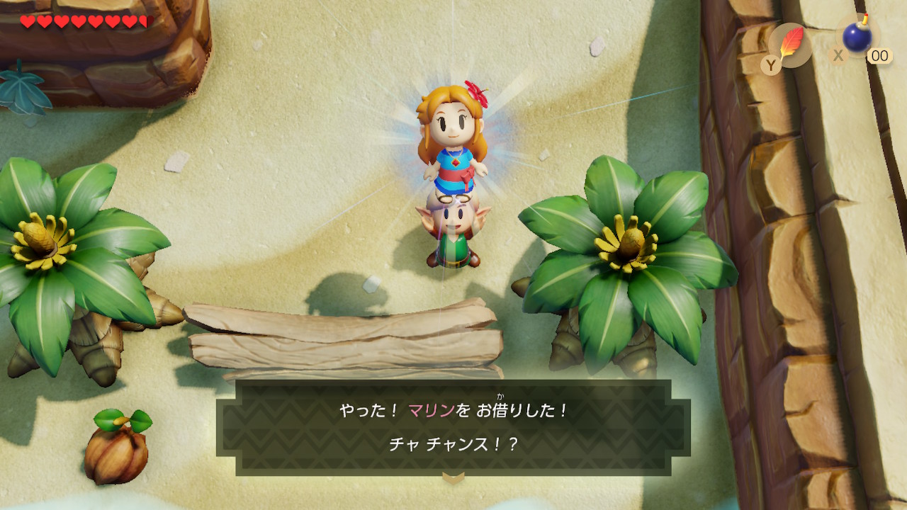

I like how the narration of the game acts like Link wants to hit it off with Marin, but being a silent protagonist means he can't express himself. I hope the narration is his inner monologue, but he's too nervous to act on it.

There is a bit of a Mario crossover in this game which I dislike. There is a character called Tarin that looks like Mario, plus a bunch of Mario enemies show up like Goombas and Piranha Plants, plus a special guest spot from Kirby. The only one I didn't mind was the cameo from Princess Peach, who shows up in a sexy photo under the alias Christine.

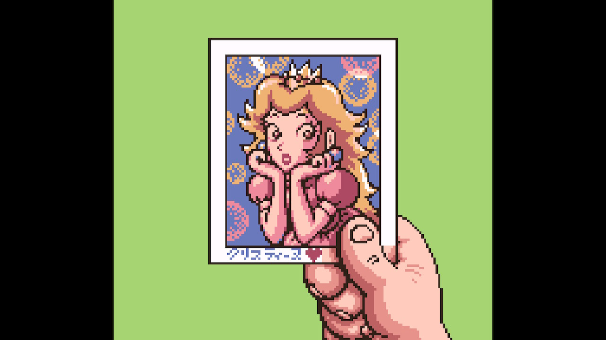

## Remake improvements

In the Switch version, the game world is no longer confined to single screens, and is instead one big world. This is really cool! But, it does make the game seem smaller than the original as you can run across areas without the short load screen in between. It also means you can sometimes see areas you aren't yet able to get to, as in DX they would have been on a completely different screen, but in Switch you can see them just over some trees.

My least favourite thing about the GBC version was that you had to constantly switch out your items to use them, and this included things like your sword and shield. Put on the Power Bracelet to pick up pots, put on your boots to run, whatever. In nearly every room you'd end up switching something out and it really hurt the pacing.

This meant I literally never had my shield equipped, and my main playstyle was to keep my sword always equipped, and then just switch out the one thing.

On the Switch, this is mercifully fixed, and in such a wonderful way. The sword and shield are always equipped, and you have two spaces to switch out items. However, loads of items don't need switching out. Once you pick up the bracelet, you can then just pick up pots, once you pick up the boots hold L to run and so on. This is a massive quality of life improvement and for this reason alone I would recommend the remake over the original.

This change also lead to more interesting enemies, as there are some enemies that you now need to block before you can attack them. A bunch of standard enemies have shields and can't be hurt unless you stagger them first by blocking one of their attacks. A mini-boss in one of the dungeons also requires this. It added a nice little bit of extra strategy to some fights.

Also improved are the fast travel points. In DX there were a few warp points, and if you stood on one if would send you to the next. If you didn't want to go there you had to jump back on and it would cycle through all the points. I say _all_ but there were only about four. In the remake they've added loads more, and standing on one lets you choose which one to go to next. Also! There is a frog that teaches you a song that in the original would teleport you to his pond. In Switch, it lets you choose which fast travel point to go to. Such an improvement.

## Remake non-fixes

A petty problem I had with the original were the powerup items. Sometimes defeated enemies would drop a temporary attack or defence powerup. Every single time you picked one of these up the game would pause and tell you what you've picked up and what it does. After the first time I knew what these items did, but it kept telling me.

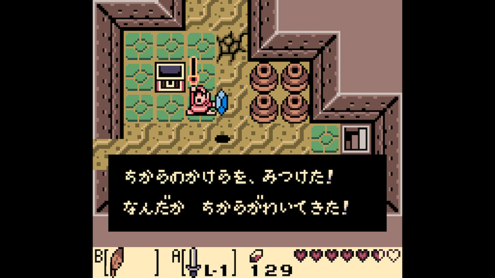

Surely they would fix this for the remake...

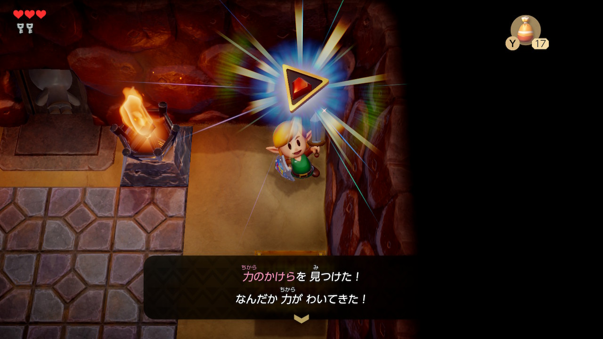

Nope! Every time you pick one of these things up it tells you all about it.

## Remake problems

I only have two problems with the remake, neither are huge and both are subjective.

First, the game has some framerate issues. The game runs at a solid 60fps, but sometimes the game will drop to 30fps for a few seconds, then return to 60fps. Reading up on it, it seems like the game drops framerate whenever it streams in a new part of the world. It's my biggest problem with the remake. It doesn't happen that often, but every now and then the framerate literally halves, then returns. I was annoyed by it every single time. Some people don't notice framerate changes, but as someone who now regularly plays games at 120fps, drops to 30fps are maddening.

I also don't like the art style. All of the characters look like miniature toys being played with on a large board. There is screen blurring along the edges of the screen to try and sell the effect as well. Wikipedia has a [nice article on the process](https://en.wikipedia.org/wiki/Miniature_faking). The blurring stood out immensely to start with but I eventually got used to it.

However I really didn't care for the toy look. It's a thing the Mario games do often but the Zelda ones seemed to avoid up until now. Nintendo want their games to be toys, which is something that clearly works for them, but for me it makes the games feel like they lack significance. I don't know a better way of putting it, but when the game constantly makes it seem like I'm playing with toys I have a hard time connecting. It's a problem I have with a lot of Nintendo games, but it's something a lot of people love about them.

## Some cool parts

Here are a few random parts of the game that are fun to talk about!

### Link is a total perv!

Whilst playing DX I came across the Mermaid who was looking for her swimsuit; I figured this would be part of a sidequest somewhere. A few hours later I hadn't found it, but I was following a guide for the trading sequence, and they mentioned you got a Mermaid's Necklace from the Fisherman. Wait, had I mistranslated the word necklace for swimsuit? Nope, as when I got there the fisherman pulled out a bikini top.

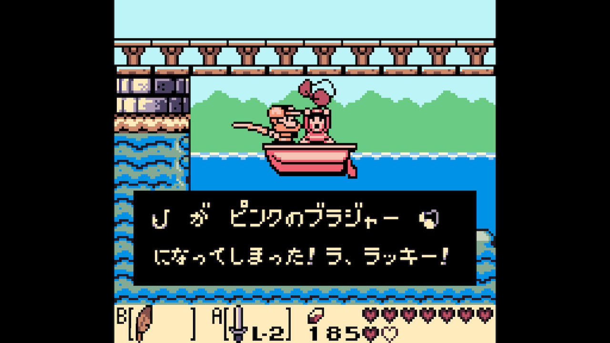

When the mermaid is looking for her swimsuit you can dive under the water in front of her and she calls Link a pervert.

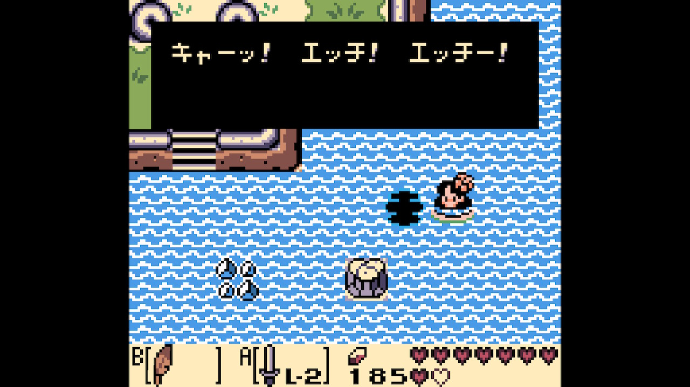

This was all too racy for the English release so they changed it to necklace. For the remake it's a necklace in the Japanese version too. Disappointed! She still calls Link a pervert if you dive underwater though. Nice.

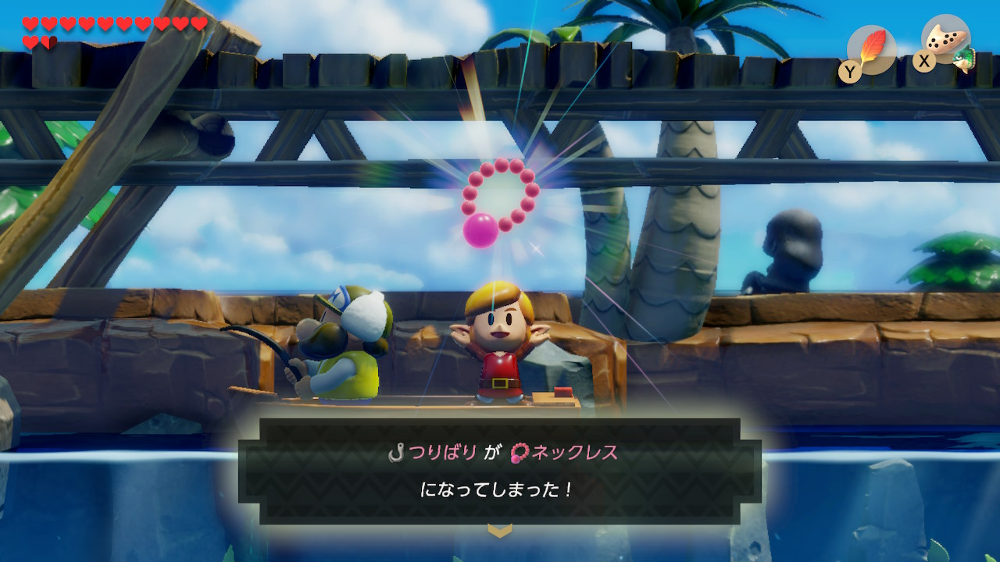

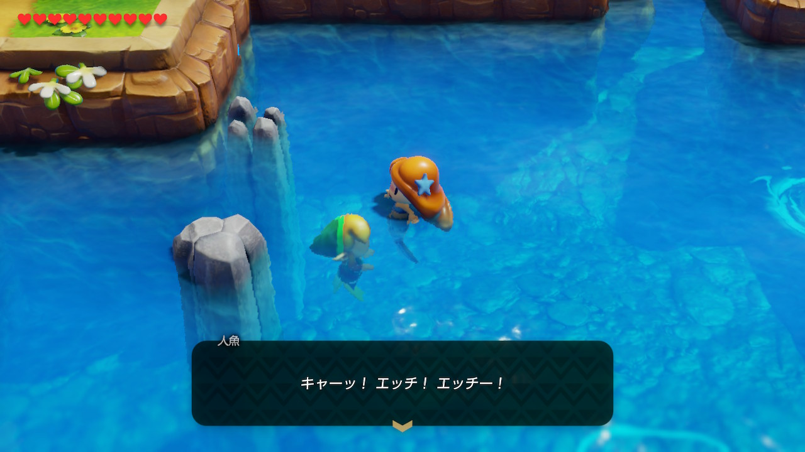

And in Switch English, she gets the same blushed look on her face, but says she won't give you a scale just yet.

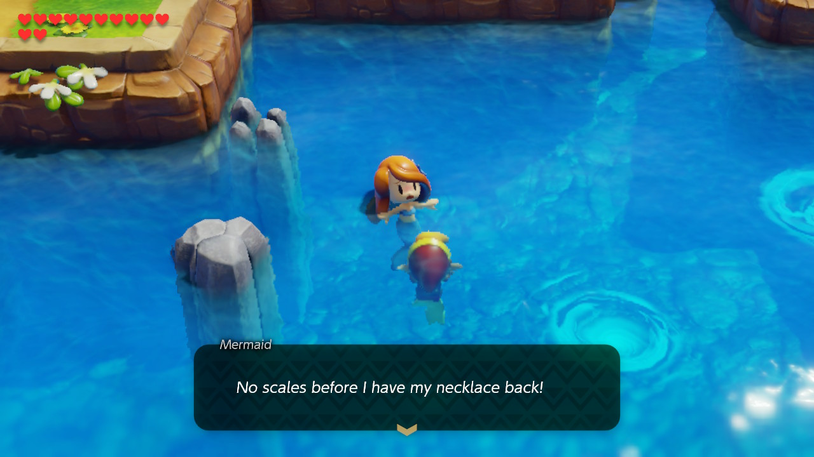

My favourite thing about this change is you know there was a board meeting with a bunch of old Japanese men debating the merits of having a topless mermaid in the game.

### Turtle dungeon

The last dungeon is pretty hardcode. First, you play a magic song on your ocarina to bring a giant stone turtle to life. Then you kill him. Then you climb inside his corpse which ends up being the dungeon. The DX version looks very fleshy inside, but the remake looks like it's made of stone.

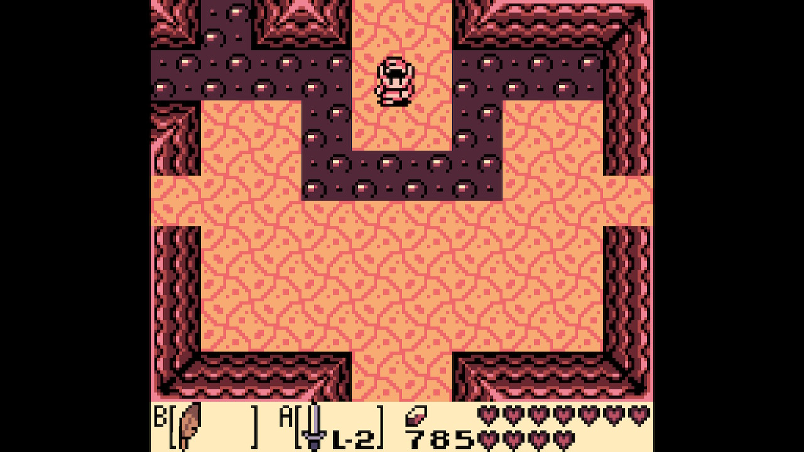

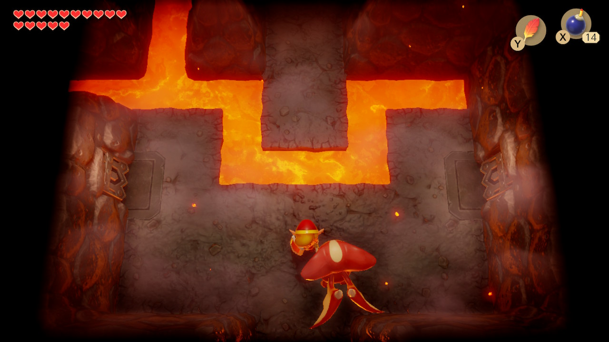

### Cello and violin

Here's a weird one. The first instrument you find is called the Full Moon Violin in Japanese, and the Full Moon Cello in English. This is true for both DX and Switch. I set my game to English and double checked the music they both make and they're the same. I wonder what's up with this change? I'm not going to research it!

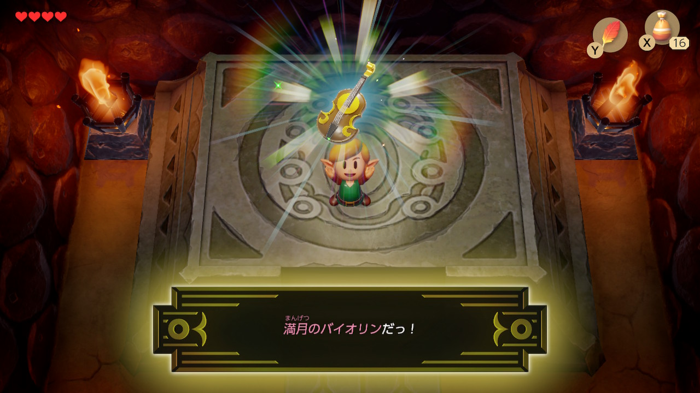

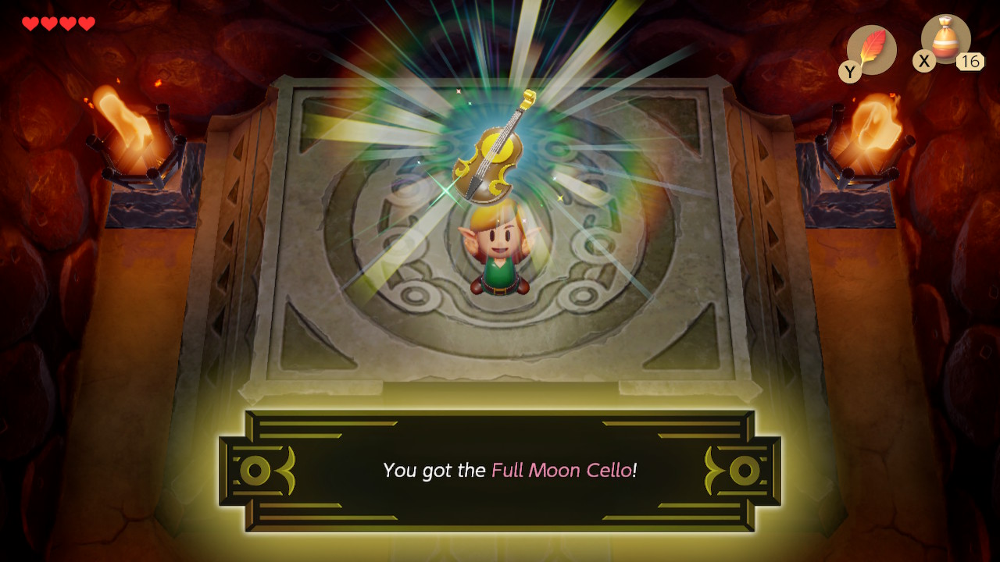

## Conclusion

Link's Awakening is a superb game, and easily one of my favourite Zeldas. The Switch remake is pretty amazing, it took a great game and made it better. My only quibbles are the framerate drops, and the art style, but they really are quibbles.

From a Japanese language perspective these games were super easy, and I'd recommend them to anyone who wants to try the language out. The GBC version has no kanji, it's all hiragana/katakana which can be awkward to read. The Switch version has kanji and it all has furigana so you don't need to know them. There's an option in the menu to turn furigana off too, which is nice.

I played Zelda no Densetsu: Yume wo Miru Shima DX on a Game Boy emulator, and beat the game in 12 hours. I used a guide for the trading sequence because fuck that.

I played Zelda no Densetsu: Yume wo Miru Shima on the Switch. I finished it in about 6 hours. I played it right after the GBC version so I knew what I was doing, therefore it's not a truly reflective playtime.

I would highly recommend either version of the game.

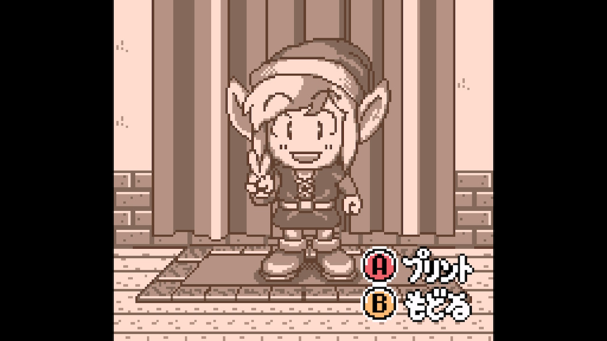
