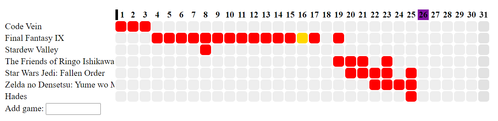

Here is another fun furlough project I've been working on, my [Video Game Tracker](http://192.168.1.148/wordpress/video-game-tracker/).

One of the projects I mentioned in my [furlough project roundup](http://192.168.1.148/wordpress/2021/03/27/furlough-funtimes/) was a video game tracker.

This exists because I currently track all the media I consume in a big spreadsheet which works great for one-off items like movies or TV shows. However it doesn't work great for video games as I was only tracking when I completed a game. Tracking every single time I played a game would completely overfill the sheet with the same thing over and over, and since I decided not to do that if I didn't finish a game it never got tracked.

My solution was to create a webpage that has a list of games where I can simply tick a box to state that the game has been played or completed. It works very well but looks rubbish as I didn't want to spend any time making something only I would see, as the page where I add games runs locally. I then take the results from that and use them to build a nicer looking page. Here you can see what the backend looks like:

Since December I've been tracking everything, but it annoyed me that the 2020 data didn't start in January, so I went through my achievement lists and added data from those. It unfortunately can't get every day I played a game, but it can get days I earned achievements in games, so it's not a total waste. I then manually matched up any completion achievements and set them to be days I completed a game.

Please enjoy the [Video Game Tracker](http://192.168.1.148/wordpress/video-game-tracker/) or carry on reading for some technical information.

## Technical fun

I used [X API](https://xapi.us/) to scrape my Xbox achievements which isn't the official API but was very easy to use and gave me everything I wanted. As I only played a handful of Steam/PS4 games I didn't bother with using any APIs and just manually added them, which only took a few minutes.

An extra wrinkle occurred this week when I decided to switch my site over to a static site. I was having problems with my hosting on GoDaddy(who are awful btw!) and nonsense caching issues that stopped my php from running, so I finally gave up and switched over to a static site. I'm still making the site locally in WordPress, and then using a plugin called [Simply Static](https://wordpress.org/plugins/simply-static/) to generate a static site. It's working nicely.

This however means that my way of drawing the games table wouldn't work, as it's done in php. The original plan was for switching years to be done via query string, but instead I had to rewrite the table creation code in JavaScript. It runs super smooth so I'm happy with the result, and the php isn't wasted as the page loads with the current year already there.

## Things to maybe add

There are a few things I would like to add. They are:

- Clicking a date box would show you any games that are related to that date. I'm not 100% sure design-wise where to fit this in.
- A better way of showing the dates. Whilst this visually looks ok, if you want to know what a specific date in the middle of the table is you have to count. I could show the date on hover but that doesn't solve the problem for mobile
- As I was able to scrape my achievements to get historical data, it wouldn't be too difficult to get games going back over ten years. It wouldn't be every date as it only would give me the days I earned achievements, but it would be something. The only time-consuming part of that would be getting images for all of the games.
- This system could easily be ported over to track reading books as well. My spreadsheet suffers the same problem for books as it does for games, but I currently track start and end dates in [Goodreads](https://www.goodreads.com/) so it's not a priority right now.
- I should probably clean up the JavaScript. It's a bit of an ugly mess, and I'll try and make it nicer if I make any other changes.

Please enjoy my [Video Game Tracker](http://192.168.1.148/wordpress/video-game-tracker/).
