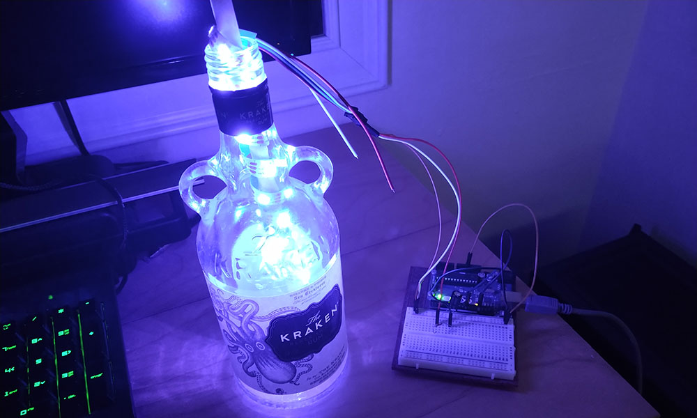
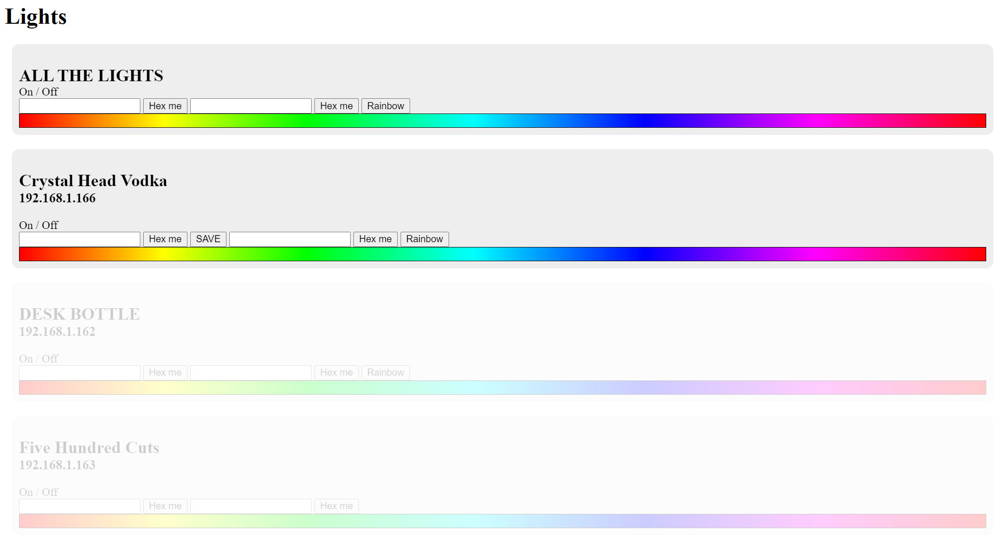
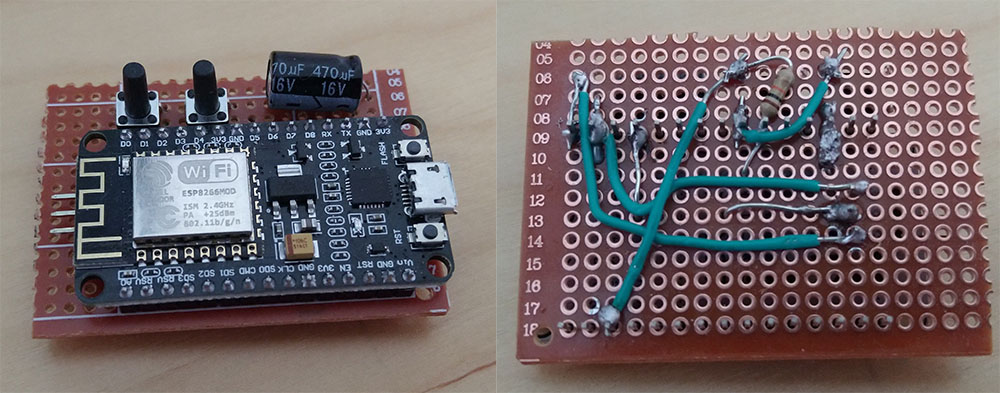
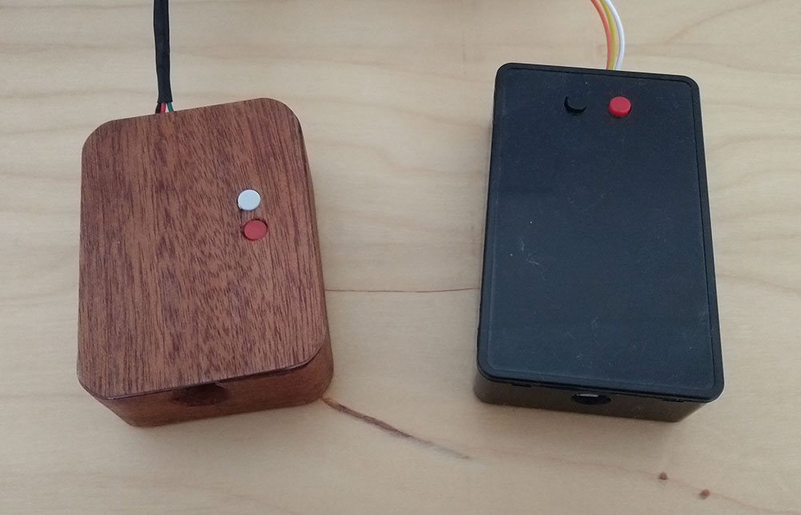

My newest furlough project took over a month, and was quite outside my skillset as it expanded into the realm of reality. I took some old drinks bottles and using some LED strips and a microcontroller transformed them into super-snazzy, wifi-controlled, colour-changing lights.

_Note: Taking pictures of lights is a skill I don't have. Please believe me when I say these look nicer in reality than in my crappy phone pictures._

## Synchronicity

This project came about due to a number of different interests falling into place at the same time. Some may call this coincidence, but they would be wrong. For when fate itself wills a project into existence, it is SYNCHRONICTY.

A few years ago I bought some [Crystal Head Vodka](https://www.crystalheadvodka.com/), which is an overpriced vodka created by Dan Akroyd that comes in a really cool glass skull. I've kept the skull all these years in hopes of doing something with it. SYNCHRONICITY!

I like drinking spiced rums, especially [Kraken](https://www.krakenrum.com/). However, as Kraken gained in popularity, my non-conformist credibility took a massive nosedive. The easiest way to remedy this was to go on Amazon, and instead of ordering bottles of Kraken, order other spiced rums starting with the cheapest. This started late last year, and since Christmas I've decided to keep all of the bottles for posterity. SYNCHRONICTY!

I watched [a video by Jenny Nicholson where she comments on Hallmark craft videos](https://www.youtube.com/watch?v=YHbtaWr6lj8) and in one of the videos they purchase a bottle cork that has lights attached, made for putting inside a bottle. SYNCHRONICTY!

I watched [a video by Matt Parker where he put individually addressable LEDs on a Christmas tree](https://www.youtube.com/watch?v=TvlpIojusBE) and thought that it looked cool. If ever I got some individually addressable LEDs I would also do something cool. SYNCHRONICITY!

Earlier this year I saw a tweet about how you should replace all light bulbs in your house with smart colour-changing bulbs, as they are now more than cheap enough. I bought a couple of them and have been very happy with my purple lamp light, but always thought I could go further. SYNCHRONICTY!

I got an [Arduino](https://www.arduino.cc/) as a birthday present years ago, had a quick play with it and thought to myself "When I get some more time, I will do something cool with this". The time for more time has arrived. SYNCHRONICTY!

With all of these disparate ideas combined, I had the idea of putting some RGB LEDs into my empty bottles and using a microcontroller to microcontrol their colour. Such is the power of SYNCHRONICTY.

## Prototyping

After deciding on this project, I had to figure out how to even make it happen. I had a play around with the Arduino when I got it but hadn't used it in years, so I started to relearn how to use that. I did a little bit of research on addressable LEDs and decided to get [a strip of WS2812B LEDs](https://www.amazon.co.uk/CHINLY-WS2812B-Individually-addressable-Waterproof/dp/B07TJDS1PZ/ref=sxin_6_ac_d_rm?ac_md=0-0-d3MyODEyYg%3D%3D-ac_d_rm&crid=1BGMH22ZUK64B&cv_ct_cx=ws2812b&dchild=1&keywords=ws2812b&pd_rd_i=B07TJDS1PZ&pd_rd_r=dbcec51b-5a86-4ef6-b2f4-692ea3f35dd2&pd_rd_w=a7TAc&pd_rd_wg=j0q6u&pf_rd_p=73573abc-9548-43f0-87cb-a185286cee4c&pf_rd_r=3JXYE8GEXXQQ5JVB64S6&psc=1&qid=1621597549&sprefix=ws2%2Caps%2C194&sr=1-1-fe323411-17bb-433b-b2f8-c44f2e1370d4). They arrived and I was quickly able to get them working with my Arduino. There is a very useful library called [FastLED](https://github.com/FastLED/FastLED) that made it simple to get things working. I then wrapped the strip of LEDs around a wooden spoon, jammed the whole thing into a bottle and had completed a proof of concept.

With things basically working, I then had to figure out how to control the colour of the lights. I could use switches connected to the Arduino to change the colour of the LEDs, but ideally I wanted to control them remotely. The Arduino doesn't have any wireless communications, so I had to find a microcontroller that did. A bit of research led me to the [ESP8266](https://www.amazon.co.uk/AITRIP-Internet-Development-Wireless-Micropython/dp/B08HQ9991S/ref=sr_1_3?crid=3C24Z2GZ2FWJQ&dchild=1&keywords=esp8266&qid=1621601130&sprefix=esp%2Clighting%2C149&sr=8-3). Buying them individually wasn't an option, so I bought two just to try them out, and once I got things working I bought a further five.

I hoped that the Arduino code I used would instantly translate to the ESP8266, but unfortunately that wasn't the case. FastLED didn't work at all for reasons that were beyond my comprehension, so I tried out a different LED library called [NeoPixelBus](https://github.com/Makuna/NeoPixelBus). It was a bit more fiddly to get working, but once it did it worked great.

The ESP8266 has a wifi module and can run a web server, so I followed a basic tutorial that let the microcontroller connect to my wifi and run a webpage. I was planning on having multiple bottles active and I wouldn't want to log into each individually to change the lights, so decided on creating a page that runs locally on my NAS to control all of them.

Thankfully, the tutorial I followed set up the chip to change the colour of the lights based on the requested url. This meant I could use javascript on my NAS page to fetch a url on the microcontroller that is full of variables. I can parse this on the micrcontroller and set the lights however I please.

<pre><code>// To set the colour using RGB
bottleIP/RGBmode=please&red=221&green=193&blue=136END

// To set the colour using HSL
bottleIP/HSLmode=please&hue=271&sat=100&lum=50END</code></pre>

As you can see, I am great at inventing syntax.

The code on the ESP8266 then reads that string and if it contains something it likes, will act accordingly.

<pre>
<code>String request = client.readStringUntil('\r');

if (request.indexOf("/RGBmode=please") != -1) {

  String rColor = request.substring(request.indexOf("&red=") + 5,request.indexOf("&green="));
  String gColor = request.substring(request.indexOf("&green=") + 7,request.indexOf("&blue="));
  String bColor = request.substring(request.indexOf("&blue=") + 6,request.indexOf("END"));

  int rInt = rColor.toInt();
  int gInt = gColor.toInt();
  int bInt = bColor.toInt();

  for (int led = 0; led < PixelCount; led++) {
    strip.SetPixelColor(led, RgbColor(rInt,gInt,bInt));
  }

  strip.Show();
}
</code></pre>
Request is a requested url. I then hackily get the red, green, and blue values into variables, convert them to integers, and feed them to NeoPixelBus. The HSL version works in much the same way. This method makes it really easy to add different lighting modes as I want.

I added a "SAVEME" check as well, where if that is contained in the url, it saves that colour to the EEPROM and starts as that the next time it's turned on. Originally I saved the colour every single time it was changed, but I read that the ESP8266's EEPROM is a bit fragile, so you should avoid writing to it wherever possible.

Another benefit for doing things this way, is that I could pre-process all the data in javascript before sending it to the ESP8266 in a format it is happy with. The microcontroller is coded in some form of C++, which I am not at all familiar with; just trying to turn strings into integers was driving me crazy! I am far too coddled by javascript, and I'm ok with that.

With the coding out of the way, I created the webpage to allow visual picking of a colour, or manually inputting a hexcode. A fancy thing I added near the end, was that on page load each bottle is sent a fetch request, and if it doesn't get a reply it fades out that control. This allows you to only interact with the bottles that are actually turned on. You're also able to change all lights at once, to keep them in sync.

## Manual labour

Confident that my prototype worked, I had to start physically building things. Firstly I had to get the lights inside the bottles. The idea was to wrap the LED strip around a piece of dowel and glue that to the underside of the bottle lid. The cables leading to the light would then exit the bottle through a hole I would drill.

Drilling glass bottles sounded daunting, but ended up incredibly easy. I bought some [glass-drilling bits](https://www.amazon.co.uk/gp/product/B08CKB5MB1/ref=ppx_yo_dt_b_asin_title_o05_s00?ie=UTF8&psc=1) and drilled the holes. Given how cheap the drill bits were I fully expected them to break, but using those it took about 30 seconds to drill a hole in the bottles. Reading up on glass drilling told me to keep the drill cool, so every five seconds I stopped drilling and dunked the drill bit in cold water. The entire process was painless! I've since drilled seven bottles with one of the drill bits and had zero problems. The hardest part was getting the wires coming off the end of the LED strip through the hole I drilled. It was fiddly!

Soldering the chips together was a whole other problem. It wasn't very much soldering, but I haven't soldered anything in over 15 years, and it's not like I was competent at it back then. I had to have a resistor going to the data line of the lights, as well as a capacitor bridging the power to smooth out any power.

I decided on having a power switch on there as well, which ended up being even more trouble. The board would be directly powered from a USB cable, so I couldn't just add a break to that. I had to have two separate momentary switches. On pressing one of them it would send a signal to the board to go to sleep. Pressing the other button would wake from sleep. An advantage for this method is that I could add an "off" button to the webpage to send the chip to sleep, but I would need to physically press the "on" button to turn it back on. Each of the switches also required resistors of their own.

You should be able to see three pointy bits coming out of the left side of the chip. These are to connect the wires coming from the lights. For my first attempt, I soldered the lights directly to the electronics, thinking that would be the best way to go about it. I then realised I wouldn't be able to put the lights into the bottle...

I now had to house the electronics inside something. I thought of simply making a small wooden box, which ended up being a big old hassle, but ended up looking amazing. I bought some veneer and stuck that to the box to make it look incredibly snazzy. Some holes were drilled into the top to let the switches go through and it was complete. Although it did take more work than I was happy with.

I discovered you can purchase small plastic boxes that are made for housing electronics projects, and like all electronics items you can't just buy one, so I ended up buying [a pack of six](https://www.amazon.co.uk/Electronic-Enclosure-Electronics-Instrument-100x60x25/dp/B08P3DDC9Z). I drilled a couple of holes in the box to allow for cables and switches, then glued some bits of plastic to keep the circuit board in place, and I was finally complete!

I now had everything in place to mass produce a whole bunch of these things, but decided against it as by now I'd spent five weeks doing this, and wanted a rest!

In celebration, I did a quick play with some code and added in a rainbow mode, which cycles the hue of the lights.

<pre><code>if (rainbowMode == true) {
  for (int led = 0; led < PixelCount; led++) {
    strip.SetPixelColor(led, HslColor(rainbow,1.0f,0.5f));
  }
  strip.Show();
  rainbow = rainbow + 0.001f;
  if (rainbow > 1.0) {
    rainbow = 0.0f;
  }
}
</code></pre>

Rainbow mode activate!

<video controls loop autoplay>
  <source src="/video/bottleLightsRainbowSkull.mp4" type="video/mp4">
</video>

## Pricelist

Calculating a price per bottle is fun, and I'm certainly **not** going to include the prices of all the various bits and bobs I also had to buy in order to do the work (soldering iron, drill bits, etc). So here is a cost of all the materials!

*   Led strip of 30 LEDs: £3.00 (£30.00 for strip of 300)
*   ESP8266: £3.80 (£18.99 for 5)
*   Perf board: £0.55 (£5.50 for 10)
*   Dowel: £0.26 (£13.00 for 50)
*   Capacitor, resistors, switches, wire: Less than £1.00 but let's round up!
*   **Total**: £8.61

So actually pretty cheap when you ignore all the time and tools that are also required. And also ignore that I have a massive pile of left over pieces. And ignoring the boxes to house the electronics, because they're optional.

## Future ideas

Now that I've finished the bottles, I'm going to look into ways I can improve them. I'm not going to do any of these things right now, as I've been working on the bottles for over a month, and want to try out a completed product before deciding to change things up. However, here are a few ideas I'm probably going to look into implementing.

### Bottle meta data

I think having the name of the bottle stored in the micrcontroller would be nice, so when I load the controlling page it knows what's connected. I could also set the number of LEDs as a variable too; I've currently hardcoded 30 LEDs for each, which works for most bottles but isn't enough for larger 1L bottles.

### LED effects

Now that all the electronics are done, I can easily add different functions to the lights, like the rainbow shown above. I was thinking of having a small twinkle effect to them to try and replicate candle flicker or something. I can also do fun blends or gradients, lights chasing up and down, or any other effects.

### LED diffusion

I feel a lack of diffusing the LEDs is the biggest failure of my bottles. Diffusion is the act of spreading the light out, so you can't see loads of LED points, but instead the whole thing would be lit up uniformly. There are a bunch of ways to solve this, but having the LEDs in the bottle made them all far too finnicky to reliably pull off.

My first thought was the fill the bottles with plastic pebble things, but they were surprisingly expensive, I would need about £10 to fill each bottle. I looked into spray frosting, but as I was doing the inside of bottles I didn't think it was too reliable. And I didn't want to do the outside because that would damage the labels. There are acids that can frost glass, but I am confident I would accidentally kill myself with the acid. I also thought of wrapping the LED core with something diffusive, but then I just gave up and decided not to bother. They look cool either way! This is something I'm going to look into again in the future.

### Webpage Clean-up

The web interface to control the lights right now is pretty ugly, a nightmare on mobile, and I have put zero effort into making the page correctly. I'm going to do a much better job with this when I can be bothered.

### Little bottles

I got a Kraken gift set over Christmas which gave me some tiny single-shot Kraken bottles. I would love to put some lights in these guys too, but the necks are too small to fit anything in. An idea would be to slice off the entire bottom of the bottle and house all the electronics in a big, chunky coaster. The set of glass cutting drills I got came with a 32mm drill which is just the right size to cut open these mini bottles bottoms. Not a project for right now, but one to do later.  

## Conclusion

I find the idea of controlling the physical world through a web page incredibly awesome, and I have loads of other ideas for things I might like to make using these microcontrollers. I'm going to have a proper research into different microcontrollers and wifi modules for the better controllers, and see what things I could try cooking up. It will be very exciting.