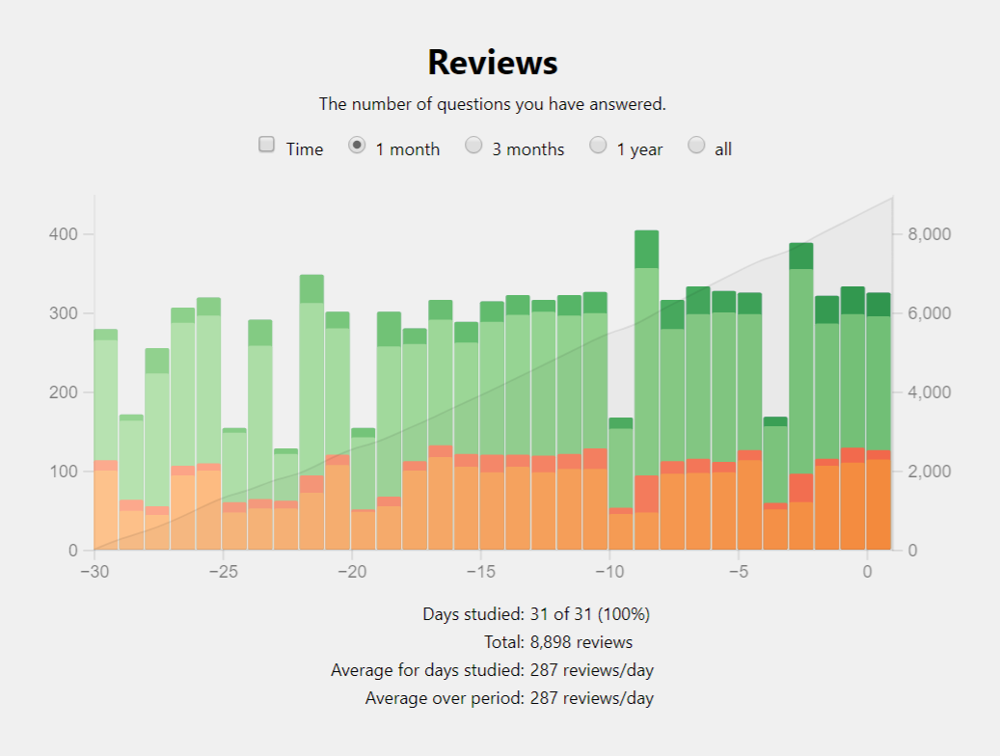

May has been a fun month in my Japanese language adventure. I have learnt some new vocabulary, read some things, and played some games. Oh the excitement!

Make sure you've read my [April progress update](/posts/2021/04/japanese-language-progress-april-2021) before this so things make a bit more sense.

## Kanji and vocabulary progress

This month I have really started to feel the burn from the constant learning of new kanji and vocabulary. These still are all kanji I've technially learnt before, but there's loads that I was never great at, or didn't use too often, so they've completely left my brain. I am getting them back, but it's taking longer than it did to start with, which is to be expected.

I've made it to chapter 40 of Basic Kanji Book, which means I've gone through 14 chapters over the past month! That's quite a lot! Basic Kanji Book only has 45 chapters so I'm going to be finishing that off next week. Once that's finished I'll be switching over to Kanji in Context.

My copy of Kanji in Context was published in 2006, and contains all jouyou kanji at that time. The jouyou kanji being the roughly 2,000 kanji that are taught in Japanese schools and all people are expected to know. However, in 2010 an extra 200 kanji were added to the jouyou list, meaning I won't be able to get all of them with just this book. Thankfully that's a problem for another year.

A slight snag is how the first 500 kanji from Basic Kanji Book don't match up with the first 500 kanji from Kanji in Context. This means I can't just start from 501 and go from there. Kanji in Context starts its intermediate section after 350 kanji so that will be my start point. For completeness sake, that is chapter 19.

I'm also going to go back and add all the vocabulary from chapter 1 in Kanji in Context just so I don't miss anything. Kanji in Context is a much more thorough list of vocabulary, so I won't be going back over words I've already learnt; I'll be gaining more vocabulary with kanji I already know. I plan on alternating new and old chapters whilst keeping the 20 new vocabulary a day. This should hopefully make things a bit easier for me without reducing the number of new vocabulary learnt.

To clarify, whilst I will be slowing down the amount of new kanji I learn, the amount of new vocabulary I learn _won't_ be slowing down. And given that vocabulary is the goal, this is completely acceptable. 

### Anki stats

Time for some stat-crunching!

Anki has updated since my last progress post, and it fixed the only real problem I was having with it. I currently have my reading and writing separated into different decks, and each of those contain loads of sub-decks for each chapter of the kanji books. Studying a higher level deck includes all cards from the sub-decks, which is great! However, it wouldn't randomize them outside of their sub-deck. So whenever practicing kanji, I would get all the kanji from chapter 1 randomised, then all the kanji from chapter 2 randomised, and so on. This was very annoying as the things I had just learnt, and therefore probably worst at, were all right at the end. The new update fixed this, so it now randomises correctly. Good job Anki!

Here's the graph of my reviews over the last month. The new update changed the colour scheme of the stats screen, so here's an explanation:
- Orange are new
- Red are vocab I got wrong on the previous day
- Light green are classed as "young", which means the interval is less than 21 days
- Dark green are classed as "mature", which means the interval is greater than 21 days

_Note: This doesn't truly reflect the percentage of new to old each day as this graph is showing reviews, and each new word needs to be reviewed at least twice on the first day you see it._

You can see from the graph that my number of reviews each day are still pretty consistent. The days with substantially less are the days when I forgot to do my reading review. I always do writing first, so if one ever got skipped it would be reading.

- Total kanji learnt: **445**
- Total vocabulary at each level:
  - Mature: **945**
  - Young: **511**

As a note, my [Kanji Progress Tracker](/kanji-progress-tracker/) has been updated with this month's data. From next month I'll allow the option to switch between the vocabulary I'm learning in Anki, and a full list of jouyou kanji.

## Japanese consumption

In which I justify reading comics and playing video games as a learning tool.

### Video games

I've just started _Dragon Quest XI_ which is currently available on Game Pass, but you have to do a bit of a workaround to get it playing in Japanese. The standard English version doesn't have Japanese language support so you have to get the Japanese version, but that's hidden if you're outside of Japan. To get access to it, you have to switch your store region to Japan, upon which the game magically appears. This downloads a separate version of the game, so don't be like me and download the English version first expecting it to contain the Japanese! Once downloaded, you can switch your store region back to the original, but you must switch back to Japan to get the game playing. I'm keeping the store region set to Japan for now, and so far nothing has broken. But I don't normally have loads of games on the go at once, so even if there are a few hiccups with other games I'm probably not going to notice.

I've also been chipping away at the first _Professor Layton_ on the DS. I got into a routine of playing it over lunch, but ended up skipping a few weeks due to boring reasons. I'm almost back into the habit now though!

### Light novels

I tried a couple of light novels but couldn't find any that has furigana, so my current kanji progress was severely holding me back. It's incredibly frustrating as looking up the reading for every other kanji destroys any momentum I have when reading.

A thought I had, which could be a nice furlough project, would be to automate adding furigana to epub light novels. There is a chrome plugin that auto-adds furigana to all kanji on a webpage. Given that an epub is just a zip full of html files, it should be possible to extract all the html, furigana the crap out of them, then recompile into a new epub. I'm going to give that a go pretty soon and I'll report back how it goes!

### Manga

Lights novels were a bit of a bust, so I started on some manga. A little manga a day is a lovely treat to help with the reading. Manga are generally for younger audiences, so all kanji have furigana with them, which is amazing! _Yotsubato!_ is a standard for easy reading and something I've read before so got bored after demolishing a few volumes.

I started reading _Namamaru Sanbatsu_, which is a manga I scanlated back in the day _(shh, don't tell anybody!)_ and never got around to finishing. That series is much more on my level, as the grammar and vocabulary is more advanced. It's a story about tricky quiz questions, and a major point to the story is how people can answer a question before hearing the entire thing, just like how people buzz in on questions on quiz shows halfway through once they've figured out what the rest of the question would be. As Japanese grammar is backwards compared to English, this makes it a great series to really hammer home the differences as things don't easily translate without sounding weird. This means you have to properly understand the grammar, and not just translate to English piecemeal and hope for the best.

## Conclusion

Things are chuggingly along nicely. As mentioned above the constant onslaught of new kanji has started to take it's toll, but I think once Kanji in Context starts and I start alternating new and old kanji it may ease off slightly. I'm going to try and stick to 20 new vocabulary a day for as long as possible!

At my current pace I will have learnt:
- the most used 1000 kanji giving my 95% reading comprehension by **22 September 2021. +13 Days from last month**
- all jouyou kanji by **14 April 2022. +16 Days from last month**
- a total of 10000 vocabulary by **15 October 2022. -4 Days from last month**