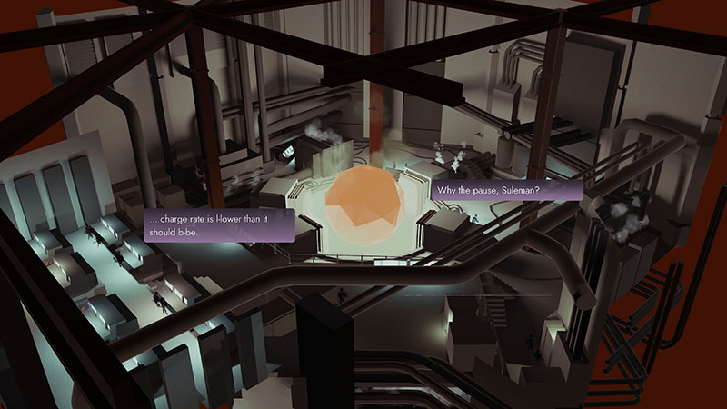

There was a swell charity bundle that recently ended on itch.io called the [Indie bundle for Palestinian Aid](https://itch.io/b/902/indie-bundle-for-palestinian-aid). It followed the Bundle for Racial Justice and Equality from last year that I also purchased. Both bundles contain literally hundreds of indie games, most of which I'd never heard of. I barely scratched the surface of the Racial Justice bundle, so for the Palestine bundle I wanted to actually play a bunch of the games.

Picking games completely at random would not be fun as, and I say this most ashamedly, there's a lot of trash in this bundle. So my plan was to go through each page of games, and pick the most interesting that I'd never heard of before. I would play each game for about an hour and then write a short blog about it, leading to a return of my [mini reviews](/tags/mini-reviews/)! How fun and simple. This would be a nice search for diamonds in the rough, fully expecting to get loads more rough than diamonds. However! The very first game I picked ended up being a sparkling diamond the size of your head!

_A Forgetful Loop_ is about a group of scientists at the end of the world attempting to make a time machine so they can go back and prevent the disaster before it ever happened. During their first major test of the machine it malfunctions and traps everyone in a 30-second time loop. Only the lead scientists realise they're in the loop, and they have to do something to fix it!

The gameplay is described as a "time-based worker-placement puzzle game" which is something I had never heard of before and doesn't actually explain anything. Is this a genre that exists that I've never heard of, or did _A Forgetful Loop_ invent this? I don't know! Anyway, gameplay involves assigning workers to fix parts of the machine called nodes, which are then slowly filled in. Once a node is fixed, it unlocks any nodes further downstream. Unlock the goal nodes to finish the level. Sounds simple, but you have a strict 30-second limit before time restarts, so you'll fail most levels your first try.

Thankfully, on subsequent loops previously unlocked nodes will unlock faster. The narrative reason for this being that your worker fixed the problem on an earlier loop so knows how to do it. I like it! As the story progresses, more characters are able to remember the loop, which gives you more workers to fix nodes. Things rapidly become more complex as you're introduced to lots of different node types. For example, _fuse nodes_ which become permanently locked early on in a loop unless you leave a worker in them, or _switch nodes_ that can only unlock one downstream node at a time, and you have to re-fix it to switch to the other.

My explanation may not sound too exciting, but I found this game to be completely enthralling. The levels take the simple idea of assigning workers to nodes to some crazy extremes, and later levels of the game are tangled knots that require quick reflexes and good planning to conquer. The game ends up with 14 workers who you have to constantly assign and re-assign as nodes are continually opening and time keeps ticking down. The last level of the game took me upwards of thirty minutes to beat, which from the start point of a 30-second loop is quite some escalation.

## Conclusion

I would hugely recommend _A Forgetful Loop_. It mixes original gameplay that simultaneously scratches the itches of twitch-fast reactions and management logistics that may not fit together for everyone, but were perfect for me. The story is well written and I am a massive fan of the "scientists trying to out-science the apocalypse" genre. I haven't mentioned the sound design, but it is full of wonderful sci-fi bleeps and pulses, plus the clock ticking down as it nears a loop reset is incredibly tense. This was such a welcome surprise, and I look forward to exploring other games from the same developer. 

I got A Forgetful Loop from itch.io as part of the [Indie bundle for Palestinian Aid](https://itch.io/b/902/indie-bundle-for-palestinian-aid). It's also available on Steam. The in-game timer lists my playtime at 9 hours 20 minutes. With that I completed all available levels and got 41/48 achievements. The missing are all easily gettable except a playtime tracker that I didn't even half fill :(

[A Forgetful Loop on itch.io](https://bighandinsky.itch.io/forgetful-loop)
[A Forgetful Loop on Steam](https://store.steampowered.com/app/1399540/A_Forgetful_Loop/)

