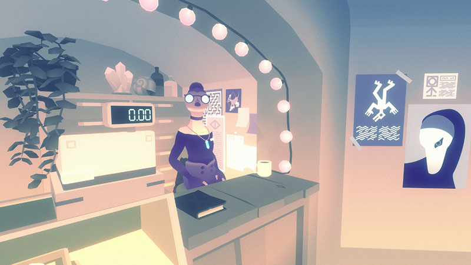

I purchased the [Indie bundle for Palestinian Aid](https://itch.io/b/902/indie-bundle-for-palestinian-aid) and have been playing random games I've never heard of that look really cool. I came across _Dépanneur Nocturne_ which is described as _"a late-night shopping adventure"_. It had a delightful screenshot so I had to give it a go. It's only about 30 minutes long. It's short, it's sweet, it's lovely!

In _Dépanneur Nocturne_, you play as someone who is looking to get a present for their partner. It's pouring down with rain, and the only shop still open is a small store full of random knick-knacks. You head inside and chat with the shopkeeper. She seems friendly so you ask for her name, it's Eugenie. There are some pastries behind the counter that will go to waste if they aren't eaten so she offers them to you for free. And there's complimentary coffee to wash them down.

With pleasantries taken care of, you look around the shop for a good gift. You find something nice and bring it to the counter. Eugenie tells you a little about the item and asks if you want anything else. You go back and find something else more suitable but Eugenie senses your indecisiveness in finding the perfect present. Thankfully, Eugenie knows a little magic, and if you go through the secret door at the back of the freezer, she can show you the best items she has and use her powers to divine what you really want to get...

Everything about this game feels like a warm hug. The interactions with Eugenie, the art style, the writing, it was all so charming and comfortable! The game is set in Quebec and can be played through in either English or French. However, you don't set the language at the start, instead when you enter the shop Eugenie says "Bonsoir" and the language you reply in sets the language for the game. I am a _massive_ fan of diegetic game design, and I really wish simple ideas like this propagated upwards to larger games. It just shows how much care was given to the experience.

## Conclusion

I found _Dépanneur Nocturne_ to be adorable. It's very short, and very cosy. I spent a scant few minutes with the game, yet I thought the atmosphere was better than most other games I've played. I think it would it wouldn't be too difficult to make a much longer game out of this concept too,

If you're a fan of experience-y games it would be worth giving this a shot. If you don't like that sort of thing, you would hate this.

I got _Dépanneur Nocturne_ from itch.io as part of the [Indie bundle for Palestinian Aid](https://itch.io/b/902/indie-bundle-for-palestinian-aid). It's also available on Steam. The itch launcher says I've played it for 28 minutes. That sounds about right.

[Dépanneur Nocturne on itch.io](https://ko-op.itch.io/dep-nocturne)
[Dépanneur Nocturne on Steam](https://store.steampowered.com/app/1285160/Depanneur_Nocturne/)

