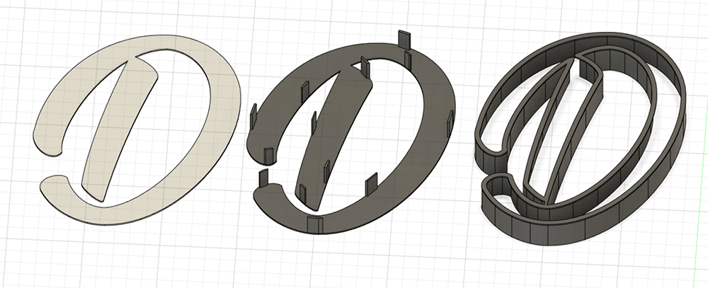

I got a 3D printer just before Christmas, and have been having a good old time printing things. I had planned to write some content about what I printed, but never got round to doing it. For the current project I've been printing, I've been doing a bit of writing along the way, which means publishing the content isn't too much extra work.

When I got my printer I made a list of all the things I would like to print. After doing my fun [light-up bottle project](/posts/2021/05/diy-bottle-lights/) last year, quite a few of the things I wanted to print involved LED strips and microcontrollers. One of the things I found most disappointing about the bottle lights was the lack of diffusion, so I definitely wanted to do something where the LED lights were diffused. I settled on printing a big Dr Dood in lights!

## Letter fun

My idea was to print the inside of each letter in white, and then print the outlines of the letters in black with a small bit of overhang so the white pieces could slot into the black and be held in place. A black backing plate would hold some LED strips behind the white plastic, which I could set to different colours, to change the colour of the letter.

The first thing I did was print some swatches in white PLA with different layer heights to see how many layers the light could travel through, and how close / far away the lights would have to be to diffuse. I ended up settling on four 0.28mm layers, as that diffused nicely at 2cm and gave enough strength. As an aside, I printed everything in this project at 0.28mm layer height which is the highest Cura will let me as a default. There's no reason to have more vertical resolution in this project as everything printed has flat sides.

As a proof of concept I designed a D in Fusion 360 and printed it off. I hadn't used Fusion before but it was simple enough to do, using the text tool to sketch the letter, turning the text into an actual sketch then some offsets to create the slight overlap and the walls. I left a 0.2mm gap between the walls and the white part so the tolerances were not too tight.

I printed this and it basically worked so I went out looking for fonts. After spending an hour on multiple font websites, I narrowed it down to about 20 and took them into Fusion. I settled on [Nature Beauty](https://billyargel.com/product/nature-beauty/), which was nice and chunky. In my head I had originally thought of a chunky metal-ish font, but the sublime hand-drawn feel captivated me.

I printed a D at what I thought was a nice size, but after printing I found out the width of the LED strips wouldn't fit. I scaled things up in Fusion and actually measured the line width of the letters to ensure the strips would fit this time.

The backing plate was the same as the white letter, and then I manually extruded some little tabs to friction fit into the wall pieces. I went a bit overboard on some of these, I could easily have got away with fewer.

## Production

With that done, I set about printing. The lower case letters took about an hour each, the big Ds took about two hours. I printed all the white flats first, and then the black backings and outlines.

I had planned on using some sort of printing trickery to friction fit the white parts into the black outlines, but ended up using superglue. I haven't done a post about a previous 3D printing project, but I learned to glue things where it's easier; just because I can 3D print a solution doesn't mean it will be a better solution than some glue.

For the lights I cut the LED strips into pieces that would fit around the letters and then joined everything with little wires. Everything has to end up in a single line, so there were some awkward parts where the wires joining the lights had to double-back over the LED strips. Wires then came out of the back of each letter and was glued to the back to join to the next, creating one giant series of 95 LEDs.

I am not great at soldering, and there was a whole lot of soldering to do with this. I got quicker as things went on though, with the soldering taking 1-2 hours per letter. It doesn't seem like much, but having to cut the LED strips, cut the wires, strip the wires, tin the wires, tin the strips, and then solder them, it all added up. It was a bit of a process and I ended up doing a letter a week, which really dragged things out. Almost all of this was small and fiddly, and I hate small and fiddly!

## Web fun

As with my bottle lights I'm controlling the LEDs with an ESP8266 that stores the colour value of each individual LED in an array. It's also running a webserver that listens for page requests. I made a page running on my NAS that uses javascript to send http requests to the ESP giving it an index and RGB values. The ESP listens for those requests and updates the array with the new values. Easy!

I used the above photo of the naked lights, and manually got the x and y position of each LED. All of those were bought into javascript which let me populate an array with each light indexed, and it's physical location. I then use javascript to draw that, allowing me to click on each light individually to change it's colour. I can also click on a letter to change the whole letter, or click on "Dr Dood" to change the whole name at once. Each light has a data attribute for which letter it belongs too, so a simple querySelectorAll gets them, and when I change the colour in real life I update the background colour of the element.

The colour of the actual lights and the colour I select on page don't always match up due to colour theory nonsense, as I'm using RGB hexcodes and directly mapping that to the brightness of each RGB LED.

And here's a video of everything in action:

<video controls>
  <source src="/video/nameLights.mp4" type="video/mp4">
</video>

## Things I would do differently

Obviously there's a whole mess of things here that I would have done differently were I to start again.

- **Connecting the letters**
  At this size I could really only print one or two letters at a time, there was no way I could print the whole thing as a single part so had to join them after I was finished. This was something I didn't realise until the very end of the project. I ended up using small pieces of plastic as a bridge, but it was difficult to locate them on the back of each letter so things went a little skew-whiff.
- **Space for the wires**
  As is, the wires are stuck to the back of the letters but it would have been nice for them to be hidden. A little crawlspace for them behind the letters would have been nice, and could be linked to the above.
- **Better light spacing**
  There are a couple of duller spots because there were places where I couldn't quite fit lights in, so it can't spread as much. If I had fully decided where to place the lights before printing, I could have spotted those darker spots. Possibly deciding that there could never be a spot that was more than 20mm from a light, for example.

## Conclusion

This was a fun project that seemed really easy but ended up very time consuming, and also left me with things I would have done differently. Throwing myself into projects like this often ends up with loads of problems that proper forethought would have fixed, but I don't have the experience to know what those problems might be. It's exciting!