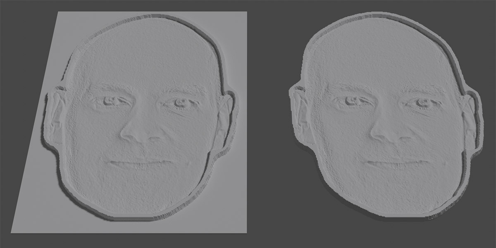
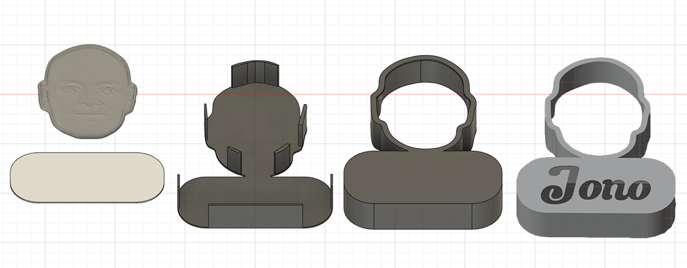
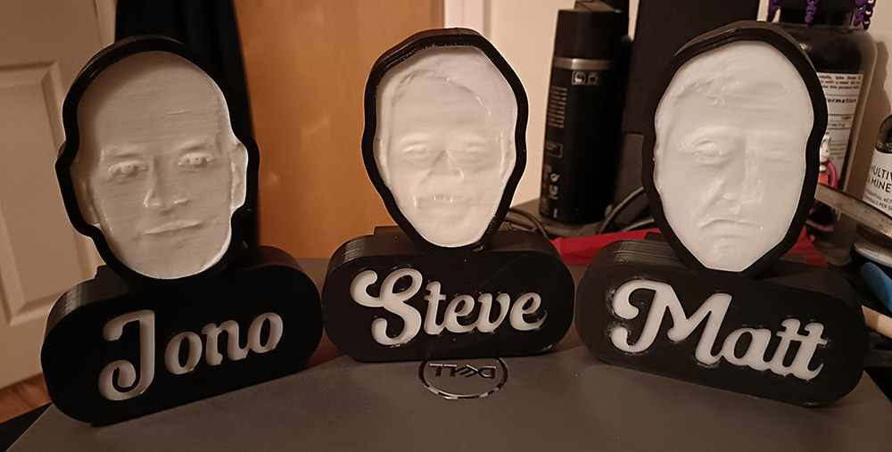
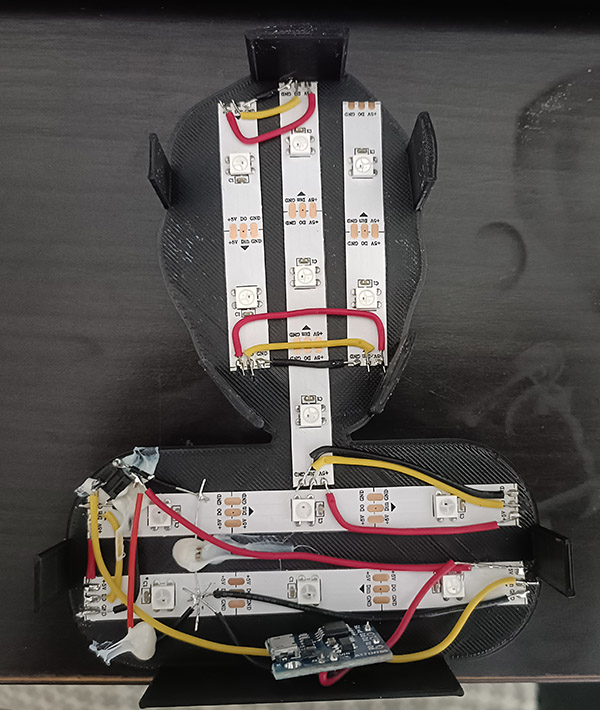

I thought I'd never want to solder LED strips together ever again after my [Dr Dood Lights](/posts/2022/04/dr-dood-lights/), but I had an idea of some presents to make, so relented. The plan was to make a lithophane of a friend's face, put their name underneath, and make the whole thing light up. And I was going to make one for three different friends. I had this idea on Sunday and I needed all three to be finished by Thursday evening. Also I have a job so could really only spend a couple of hours of work per day on them.

## Lithophanes

I have dabbled with lithophanes before and they are simple to make, just upload an image to [a website](https://3dp.rocks/lithophane/) and download the model. However the site only produces square models, whereas I wanted the models to just have the face and nothing more.

I gave each face a black outline, and set the background colour to white. The black outline would create a full-height lithophane section, and the white background would be the minimum height. I downloaded the model and imported in to blender. It was easy enough to boolean away the white background, leaving me with a lithophane of a backgroundless face. To finish off I needed to extrude the back of the remaining face the same distance as the removed background, else the contrast of the finished lithophane would be messed up.

Lithophanes work best if printed standing up and I was concerned that the rounded edges at the bottom of the face would make it really awkward to print, so for the first time I printed using a raft. The faces stuck perfectly during printing and snapped off easily once done. It didn't matter that the snap-off wasn't super clean because you'd never see the edges of the faces as they are hidden by a black border.

## Fusion 360

To create the outline to hold the face in place I took the cleaned up model into Fusion 360 and used bezier curves to roughly trace it. This only took a couple of minutes and actually ended up working nicely as the bezier curves gave a very nice, smooth border that I liked. I then offset 2mm to cover the face, and 0.5mm and 1.7mm in the other direction. The 0.5mm was just a spacer so tolerances weren't super tight, and then the remaining 1.2mm section was extruded 25mm to create the sides. A 0.4mm nozzle on my printer meant that the sides would be exactly 3 walls thick.

For the name box, I simply sketched out a square, gave it rounded corners, and stuck it to the face. The idea was to cut the letters out of the box, and then have a white panel behind to diffuse the light. I tried to cut out the names in Fusion but the font I chose didn't play nicely so I exported as an stl, imported into Blender, and boolean'd it out. I created backing plates with friction fit tabs to hold the thing together, and the modelling was complete!

The pieces were all printed out, I checked everything fit together nicely then glued the white sections to the black outlines so they wouldn't move. I also had to glue the inside black parts of the letters to the white backing plate. All of the 3d printing was complete!

## Electronics

I was on a tight turnaround and didn't have any idea what I'd use for electronics or what functionality the lights would have when I started printing. I bought some [ATtiny85s](https://www.amazon.co.uk/Digispark-Miniature-Microcontroller-Development-Compatible/dp/B08PB8Z1BW/) which are tiny microcontrollers that could be placed inside the faces. Previously I'd used the ESP8266 which has onboard wifi so I could control the colours with a webpage, but the Tiny doesn't have that so I went with a button that let you pick a colour, and programmed a double tap of the button to activate a rainbow animation.

Being that these were going to my friends for free, I was super cheap and bought light strips that had 30 LEDs per meter (the big Dr Dood was 60 per meter). I wasn't sure how well the light would be diffused using these but it actually worked out very well. I remembered to measure out the LED strips and use that information to pick the size of the faces and name box before I started, which meant the electronics fit together nice and snugly.

I used a three AA battery pack which supplied 4.5 volts to power the whole thing and velcro'd that to the back. I drilled a hole for the battery wires to get in, and another hole for the colour-picking switch. I glued the switch in place but chose a poor location for it as there wasn't a tab near it. This meant that when pressing it, the button itself didn't press, the entire back panel pushed in! I quickly printed an extra tab and glued it on so the switch became usable.

## Completion!

And the whole thing was completed! Please enjoy this video of the faces rainbowing in delight:

<video controls>
  <source src="/video/electricFriendFaces.mp4" type="video/mp4">
</video>

As with all of my light up imagery, these things look better in person than through photos.

I bequeathed the Friend Faces in an outside location and found out that the lights can barely be seen in direct sunlight. When indoors they're very bright, but there just aren't enough lumens in the LED strips to overpower Sol's might.

## Conclusion

These were really fun to make, and went from idea to completion in five days. I again made simple mistakes that I didn't have the experience to avoid, but the quick turnaround meant I had to think fast and just get things done. Making three of the same thing also led to some challenges, as I didn't have time to check the first one worked before having to start printing the next. Having to drill holes for the batteries and button, plus having the issue with the button not pressing correctly are examples of such problems that hopefully I'll avoid in future projects.

I'm going to set ridiculous deadlines for the next few things I make, just so I can increase my output. Whatever's next will certainly be exciting!