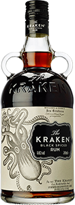

Welcome to the Dood Vei Spiced Rum Tracker!

Here you can see all of the spiced rums I've drunk. Sort by a wide variety of traits, or filter by your favourite consumption vector.

**Note on ratings:** I can honestly say all of these rums were at least ok. Outside of one in particular I enjoyed every single drink of these I had, regarldess of what I mixed them with. Neat is a different story, but that's fine. I like to like things, especially when those things are spiced rums.

<h2>A whole bunch o rums</h2>

<ul id="rumSorter">
</ul>

<ul id="rumMixerPicker">
</ul>

  

  

    

      

      

        
      
  
    

  

  

  

    

      
x

      

        <h2 id="rumSingleTitle">Kraken</h2>
        

          

            
Price: £17.93 
            Volume: 100ml 
            Percentage: 100% 
            Total units: 51 
            Price per unit: £3.01

            <h3>Style</h3>
            

          

          

        

        
<h3>Quality of Tastings</h3>

        <h3>Notes</h3>
        
Super tasty or whatever.

      

    

  

